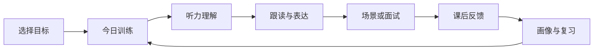
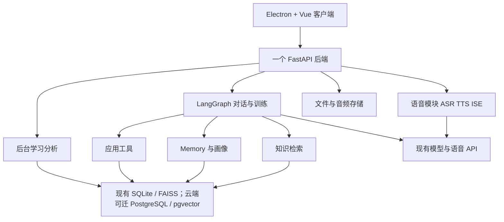
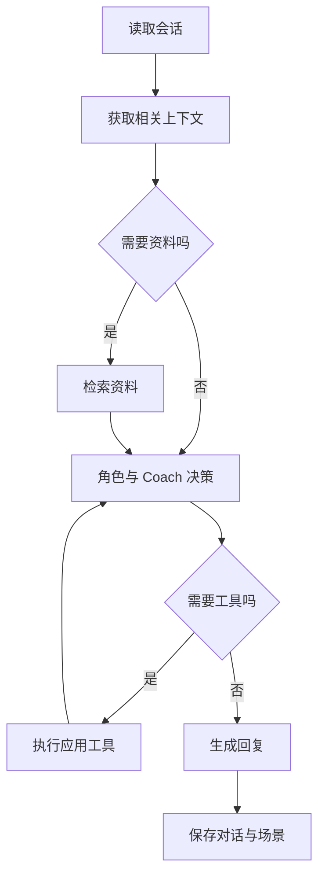
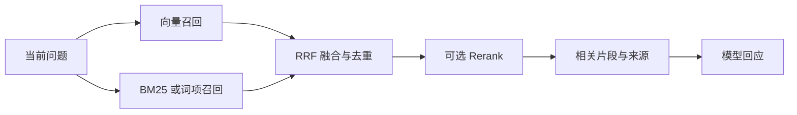
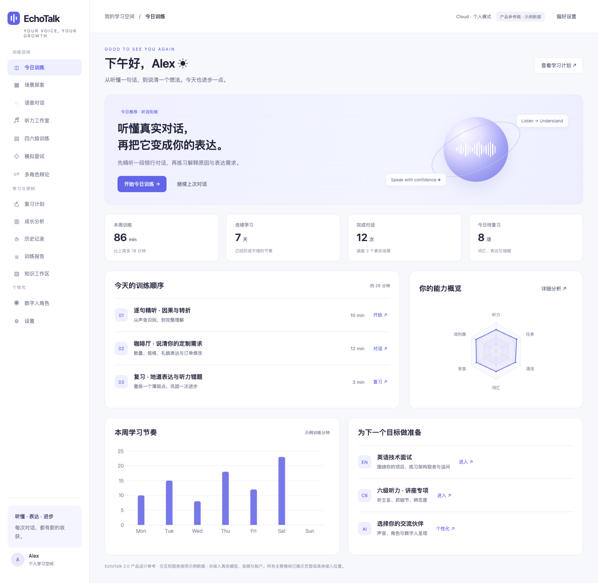
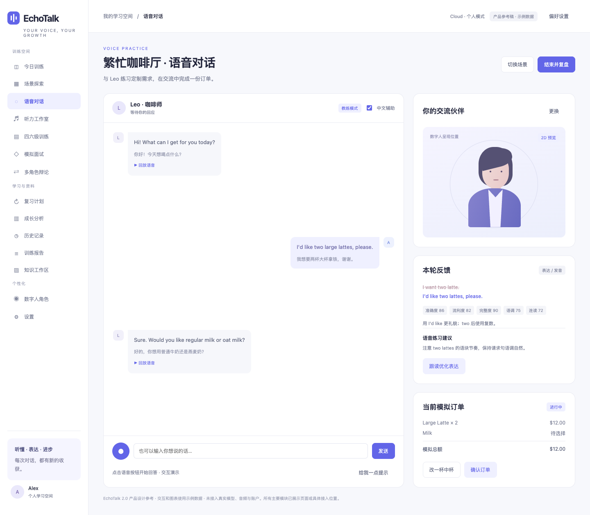
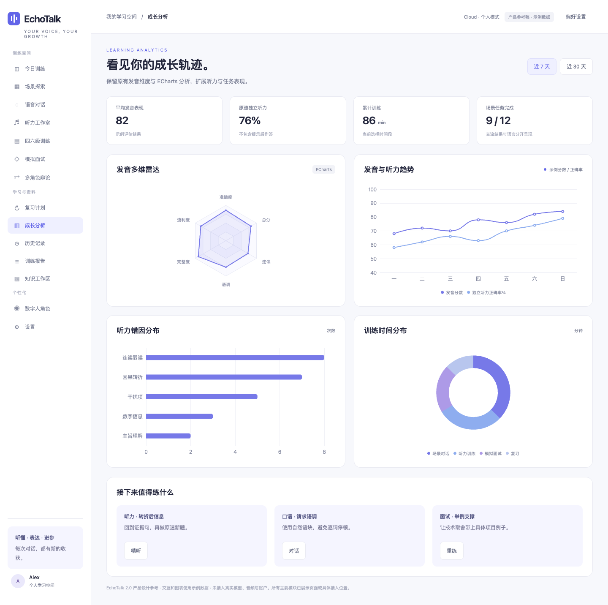
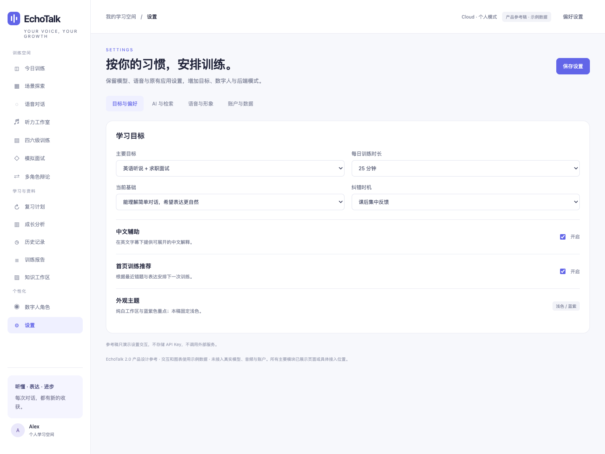
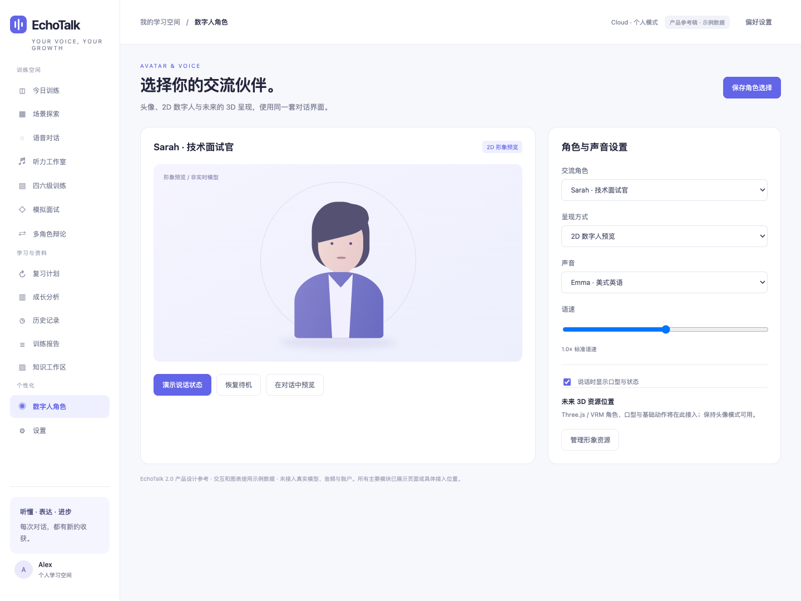
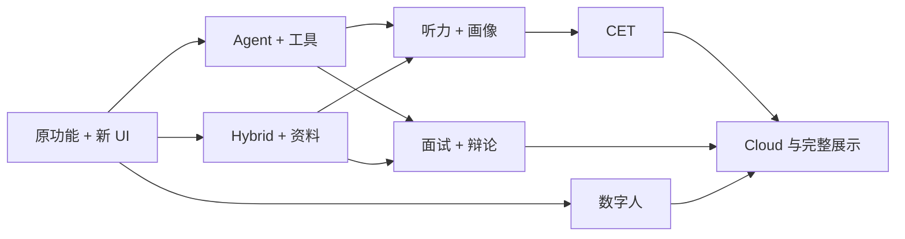

# EchoTalk 2.0：完整产品与实施设计

> 面向英语听说、四六级听力与面试沟通的 AI 训练桌面应用。

版本：v2.0 设计稿 · 更新：2026-09-27 · 面向：个人开发、学习实践与 AI 应用开发 / Agent 工程实习作品集。

本版以“做出可复现、可评测、能解释技术取舍的产品”为目标。重点是稳定的语音训练主流程、真实的工具与检索、学习反馈，以及能用于求职展示的工程证据。技术方案采用一个模块清晰的后端、必要的数据持久化和关键路径测试；具体框架只在解决实际问题时接入。

现状依据原对话和 [EchoTalk 公开仓库](https://github.com/Ackow/EchoTalk)。本目录提供设计文档与完整界面参考稿；参考稿的对话、分数和反馈为示例，真实模型与语音接入在实施路线中完成。

**阅读口径：** 下文的 2.0 页面、Graph、Hybrid 检索、听力与画像是目标设计，不代表当前仓库已经实现。当前代码有 Vue 3 / Electron、FastAPI、场景对话、语音与评分适配、FAISS 检索、历史和分析；前端仍为 JavaScript，当前路由只有今日训练 / 场景、对话、历史、分析、设置。求职材料只能写已运行、已验证的部分。仓库内没有个人简历或目标 JD，本版按“AI 应用开发 / Agent 工程实习”作为默认岗位画像；拿到具体 JD 后再裁剪展示重点。

## 阅读导航

- [1. 升级目标与实施范围](#1-升级目标与实施范围)
- [求职岗位依据与项目证据](#12-求职岗位依据与项目证据)
- [2. 产品定位与训练闭环](#2-产品定位与训练闭环)
- [3. 简洁的总体架构](#3-简洁的总体架构)
- [4. 云端、本地与打包体积](#4-云端本地与打包体积)
- [5. 主流技术栈](#5-主流技术栈)
- [6. LangChain / LangGraph 落地](#6-langchain--langgraph-落地)
- [7. RAG / LightRAG / GraphRAG 选择](#7-rag--lightrag--graphrag-选择)
- [8. Tool Calling 与任务场景](#8-tool-calling-与任务场景)
- [9. Memory 与学习画像](#9-memory-与学习画像)
- [10. 听力训练体系](#10-听力训练体系)
- [11. CET4 / CET6 模式](#11-cet4--cet6-模式)
- [12. 多 Agent 面试与辩论](#12-多-agent-面试与辩论)
- [13. 数字人与声音](#13-数字人与声音)
- [14. 完整前端设计与参考图](#14-完整前端设计与参考图)
- [15. 数据结构](#15-数据结构)
- [16. 接口与流式交互](#16-接口与流式交互)
- [17. 评测与开发调试](#17-评测与开发调试)
- [18. 部署与运行成本](#18-部署与运行成本)
- [19. 从现有项目迁移](#19-从现有项目迁移)
- [20. 详细分阶段实施路线](#20-详细分阶段实施路线)
- [21. 求职价值与展示](#21-求职价值与展示)
- [22. 实现取舍与后续扩展](#22-实现取舍与后续扩展)
- [23. 首批开发任务与完成标准](#23-首批开发任务与完成标准)
- [24. 参考资料与文件清单](#24-参考资料与文件清单)

## 1. 升级目标与实施范围

EchoTalk 2.0 保留现有桌面应用的主体：场景选择、语音对话、发音评估、语法纠错、知识资料、课后总结、历史回放与 ECharts 成长分析。在这个基础上，补齐听力训练、用户画像、Agent 决策、任务状态、面试 / 辩论以及数字人。

| 方向 | 希望做成的功能 | 实现深度 |
|---|---|---|
| 听说 | 语音对话、字幕辅助、纠错、跟读 | 稳定使用现有 ASR / TTS / ISE，再改善等待与播放 |
| 听力 | 精听、听写、逐层提示、错因、专项 | 少量精心整理的课程先跑通闭环 |
| CET | 四级 / 六级专项与整套模拟 | 蓝图正确、样例套题完整、可回看证据 |
| Agent | 根据训练目标追问、提示、查资料与执行动作 | LangGraph 实现有状态的对话与训练决策 |
| RAG | 场景知识与面试资料检索 | 现有 FAISS 作基线，Hybrid 为升级目标，LightRAG 可选 |
| Memory | 偏好、薄弱点、最近错误与复习计划 | 结构化存储与简单更新规则 |
| 面试 / 辩论 | 角色轮换、资料驱动问题、质询和报告 | 先少量有职责的角色，完整体验优先 |
| 数字人 | 角色选择、声音、说话状态与基础口型 | 头像 / 2D 首批可用；3D 后续接入 |
| 前端 | 所有主要模块都有页面、控件和数据位置 | 不只提供首页与少数练习页 |
| 用户 | 基础登录、偏好、本人历史与进度 | 满足个人学习空间，暂不做组织管理与支付 |

### 1.1 分成三个交付层次

**第一层：求职可演示闭环。** 保住现有语音对话与评分，再完成一个有状态的工具场景、可引用的资料检索、一次训练报告和可复现的评测。听力与画像先做一条小路径。这一层完成后即可作为求职演示。

**第二层：完整应用体验。** 补齐 CET、资料驱动面试、辩论、知识工作区、数字人 2D、历史与分析、设置及基本云端账户。所有模块的界面都提前在本参考稿中呈现，便于按最终结构实现。

**第三层：有价值再扩展。** LightRAG、3D 形象、更多内容、更细的语音对齐、更准确的自适应算法。根据时间选择，不影响第二层成为完整作品。

### 1.2 求职岗位依据与项目证据

截至 2026-09-27，抽样核对的 [AI 应用技术工程师实习 / 正式岗位](https://jiuye.uestc.edu.cn/career/recruitment/internship/fwc7tjq3xh4x)要求 Python、REST API、数据库、Git / Linux、RAG、工具调用、部署、基础评测与文档；[上海 AI 实验室 Agent 算法实习岗位](https://www.shlab.org.cn/joinus/detail/7674919310473431306?mode=campus&subject=7538649065812363566)进一步强调复杂工作流、轨迹数据和任务评测。岗位样本不能代表全部市场，但足以提醒本项目优先展示**可运行系统与可复现结果**，而非堆砌框架名。研究型岗位还要求更强的算法和实验背景，EchoTalk 本身不替代这些经历。

| 岗位常见要求 | EchoTalk 应交付的证据 | 优先级 |
|---|---|---|
| Python 后端、API、数据库、部署 | 一键启动说明、接口契约、持久化会话、Docker 复现记录 | 高 |
| Agent、Tool Calling、状态管理 | 订单修改前后状态、工具参数 / 结果、失败与重试轨迹 | 高 |
| RAG、文档处理、答案依据 | 文件解析、带来源的检索结果、纯向量与 Hybrid 对照 | 高 |
| 质量、速度、成本与定位 | 固定样例集、关键指标、典型失败案例和延迟拆分 | 高 |
| 多模态交互与产品体验 | 真实录音到回复、播放中断、报告回看与下一次练习 | 中 |
| 多角色、图检索、3D 形象 | 在核心路径稳定后按目标 JD 做专项扩展 | 低 |

具体简历和演示的写法见第 21 节。此表是实施优先级，不是完成情况。

### 1.3 最重要的两条演示路径

听力路径：首次答题 → 提示 / 原文 → 定位错因 → 精听跟读 → 新题或场景迁移 → 报告 → 下一次计划。

Agent 路径：点餐 → 查询菜单 → 改数量或规格 → 工具更新订单 → 确认结果 → 结束任务 → 报告。让用户能看到 Agent 做了什么，以及它如何影响训练。

## 2. 产品定位与训练闭环

定位：**帮助大学生与初入职场者听得懂、说得清、应对真实沟通的 AI 训练应用。** 四六级给听力训练一个明确目标；项目面试、会议和场景交流提供更多应用空间。

| 用户 | 困难 | 训练结果 |
|---|---|---|
| 英语输入基础弱 | 字幕认识，声音听不出 | 建立声音与语块联系，逐渐减少辅助 |
| CET 备考者 | 错题只知道正确选项 | 找到证据、理解干扰项、练同类能力 |
| 求职学生 | 项目表达松散，追问答不清 | 围绕本人材料讲经历、理由、例子与取舍 |
| 职场学习者 | 会背句子，任务沟通困难 | 汇报、协商、澄清和主动确认 |



初次使用：选择目标与大致基础 → 做一个短练习或直接体验 → 收集几次表现 → 更新计划。无需一开始做完整标准化测评。

交互中反馈控制节奏：影响理解的问题及时提示，普通语法与地道表达集中放课后。用户可以选教练训练或较严格的模拟。首页说明今天练什么、为什么练、预计多久；报告给出具体句子与下一步行动。

## 3. 简洁的总体架构

### 3.1 推荐架构



先使用一个后端代码库与一个 API 服务。语音、Agent、检索、学习、用户分别是内部模块；不用拆成多组微服务。低并发作品阶段，后台总结可使用 FastAPI BackgroundTasks 或应用内异步任务。后续任务确实变多时再加入 Redis + Celery 等 worker。

后台任务在作品阶段可以依赖进程运行；未完成任务保存状态，用户可重新生成报告即可。无需先建立 outbox、复杂事件总线和企业级任务恢复体系。

### 3.2 实时对话循环

录音 → ASR → 读取少量上下文与画像 → 按需检索 → Agent 决策 / 工具 → 回复 → TTS → 播放。

ASR、音频转换、TTS、播放是普通服务；Agent 决定追问、帮助、查资料或下一任务。普通问候与简短回应可以不检索。现有的评估并发思路继续保留，优先减少语音等待。

### 3.3 后台学习循环

会话结束 → 总结语法与表达 → 整理听力错因和发音结果 → 更新薄弱点 → 保存复习任务 → 返回报告。

可以先只在会话结束后分析，不必每轮都重新更新画像。报告保存为一条可重新生成的记录，按 session 更新；避免用户刷新就重复累加表现即可。

## 4. 云端、本地与打包体积

LangChain / LangGraph 可以放在云端，也可在独立本地后端运行。桌面包体积更需要关注 Python runtime、科学计算依赖、模型库与权重，不只看框架名称。

### 4.1 推荐默认模式

**保留 Electron，默认连接云端 FastAPI。** 桌面主包只放 UI、录音、播放、本地缓存与轻量形象，Agent 和检索运行在后端。这样增加智能能力通常不需要继续把 Python AI 环境塞进安装包。

| 模式 | 怎么实现 | 初期用途 |
|---|---|---|
| Cloud | 客户端连接个人部署的 FastAPI | 最容易给别人安装体验 |
| Local / BYOK | 开发者启动本地后端；使用个人 API Key 或本地模型 | 开源与学习，先不做复杂 runtime 安装器 |
| Custom | 设置页填写兼容服务器地址 | 便于自己或他人部署 |
| 离线内容 | 缓存已下载音频、字幕与练习进度 | 无网时做精听与复习 |

Local / BYOK 如果仍调用外部模型，需要网络；完整离线自由对话则另装 ASR / LLM / TTS。设置页解释清楚即可。

### 4.2 实施步骤

1. 前端 API base URL 配置化，录音和播放与后端连接分开。
2. Cloud 打包不默认附带 Python 后端；开发时仍可同时启动前后端。
3. 本地使用 README 提供启动方式，先支持已有环境，不急于自动安装全套模型。
4. 默认 embedding 使用 API 服务或服务端模型；桌面不附带大模型权重。
5. 听力资源与数字人资源按需加载，3D 资源后续下载。
6. 比较改造前后同平台安装包大小，记录依赖和资源组成。

暂时保持 Electron。Tauri 可以单独做体积与功能实验，避免同时更换客户端框架、后端部署和 Agent 架构。

### 4.3 云模式与商业化关系

云模式主要解决分发、环境与学习进度问题。一个自己部署、支持基础账户的后端就足够，不需要将作品立即变成收费 SaaS。支付、订阅、组织空间与商业运营不进入当前路线。

## 5. 主流技术栈

| 层 | 推荐技术 | 用法 |
|---|---|---|
| 桌面 | Electron + electron-builder | 沿用现有窗口、音频与安装流程 |
| UI | 现有 Vue 3 + JavaScript + Vite；关键接口逐步迁 TypeScript | 先把语音与 SSE 契约写清，再迁易出错的模块 |
| 路由 / 状态 | Vue Router + Pinia | 页面导航、会话、播放器和偏好 |
| 样式 | CSS variables + scoped CSS | 白色 / 蓝紫 token，统一控件与间距 |
| 分析图 | Apache ECharts | 原有发音雷达、趋势，扩展听力错因和时间分布 |
| 音频 | MediaRecorder + Web Audio API | 采集、播放、基础波形；复杂处理按需加入 AudioWorklet |
| 后端 | Python + FastAPI + Pydantic | REST、SSE、输入输出数据结构 |
| 数据 | 现有 SQLAlchemy + SQLite；云端 PostgreSQL | 先保住历史和会话迁移，再做云端数据层 |
| 检索 | 现有 FAISS 基线 → 词项检索 + RRF；云端可选 pgvector | 先得到可比较的 Hybrid 结果与来源 |
| Agent | LangGraph + 必要 LangChain 组件 | 在多轮状态与工具分支有需求时接入，首个图只覆盖一个场景 |
| 模型 | 现有 LLM API，经统一 adapter | 不必先替换供应商 |
| 语音 | 现有腾讯云 ASR / TTS 与讯飞 ISE adapter | 复用，再按体验优化 |
| Memory | 业务表 + 简短画像摘要 | 偏好、最近错误、复习任务 |
| 数字人 | 头像 / 2D；后续 Three.js + VRM | 呈现角色、口型与状态 |
| 文件 | 本地目录，云端可选 S3-compatible 存储 | 音频、文档、形象资源 |
| 后台分析 | BackgroundTasks / asyncio | 先完成课后报告；Celery 后加 |
| 调试 | 结构化日志 + LangSmith 或 Langfuse 选一个 | 看清工具、模型与检索过程 |
| 验证 | pytest + 少量 Playwright + 固定评测样例 | 核心函数、端到端路径与检索 / 工具结果 |
| 部署 | Docker / Docker Compose | 单个后端和数据库，便于别人复现 |

采用 pgvector 时可和 PostgreSQL full-text search 融合；后者的默认排名不是 BM25。如果使用 BM25，可在小型资料集先用简单库实现，无需为了检索引入完整搜索集群。[pgvector 官方说明](https://github.com/pgvector/pgvector) 先记录现有 FAISS 的检索基线，再决定是否迁移，避免把“换数据库”误写成检索质量提升。

前端暂不增加 Vue Query / XState 等依赖，Pinia 与清晰的会话状态足以起步。遇到明显的数据缓存或状态复杂度，再选合适库。

### 5.1 推荐后端结构

```text
backend/app/
  api/              sessions、scenes、listening、users、reports
  agents/           conversation、coach、interview、debate
  services/         asr、tts、assessment、rag、memory
  learning/         analysis、profile、review_plan
  models/           业务数据与 Pydantic 类型
  content/          场景、课程、试卷与 rubric
  storage/          文件与数据库访问
```

版本在实际开发时按现有依赖兼容性锁定。先只安装用到的 LangChain provider 与检索包，减少重复依赖与环境问题。

## 6. LangChain / LangGraph 落地

LangChain 用于模型、消息、工具与检索集成；LangGraph 用于跨轮训练状态、阶段与决策。LangGraph 也能独立使用，不要求安装所有 LangChain 组件。[LangGraph 官方概览](https://docs.langchain.com/oss/python/langgraph/overview)

### 6.1 先实现两个图

| Graph | 内容 | 实现次序 |
|---|---|---|
| ConversationGraph | 读上下文、检索、角色回应、工具与场景推进 | 第一个真实场景先完成 |
| LearningGraph | 课后总结、错因、画像与复习建议 | 可以先普通函数，再整理成图 |
| Interview / Debate 子图 | 角色、阶段、问题与质询 | 核心流程后复用 |



ASR 与 TTS 可以放在图调用前后，不必将整个音频处理塞进图。工具循环设一个简单调用次数上限，避免无限调用就足够。

### 6.2 会话状态

```python
# 结构示意，不是完整代码。
class ConversationState(TypedDict):
    session_id: str
    mode: str
    messages: list
    learner_summary: dict
    scenario_state: dict
    knowledge_context: list
    tool_results: list
    current_stage: str
    response: dict
```

状态包含当前任务和阶段，例如订单规格、面试主题或辩论轮次。会话消息放少量近期记录与摘要，文件和音频只保留引用。

### 6.3 基础持久化

开发使用 SQLite checkpoint 或现有数据库保存会话；云端需要继续训练时可用 PostgreSQL checkpoint。先满足关闭应用后仍可读历史与恢复阶段，不把复杂跨版本恢复作为首批工作。[LangGraph Persistence](https://docs.langchain.com/oss/python/langgraph/persistence)

前端沿用自己的简单 SSE 事件。LangGraph 内部消息与状态转换成前端需要的状态、文本、音频与反馈即可。[LangGraph Streaming](https://docs.langchain.com/oss/python/langgraph/streaming)

## 7. RAG / LightRAG / GraphRAG 选择

### 7.1 先做好 Hybrid RAG

当前升级优先级：资料整理 → 标题 / 表格分块 → 语义与词项双路召回 → 融合 → 重排 → 给回复附来源。



菜单价格和订单金额直接用工具；背景资料、简历、JD、项目说明用检索。对于日常问候或当前流程指令，不用每轮都 RAG。

分块保留标题、文件名、页码或段落位置。先按场景 / 工作区限制资料范围，降低无关结果。向量与稀疏各取十几条，融合后选 3–5 条作为起始配置，再用样例查询调整。

### 7.2 LightRAG 用在哪

LightRAG 将图结构与向量检索结合，适合跨实体与资料的关联场景。[LightRAG 官方仓库](https://github.com/HKUDS/LightRAG)、[论文](https://arxiv.org/abs/2410.05779)

适合 EchoTalk 的试验：简历中的项目 → 采用的技能 → JD 要求 → 对应面试问题。例如“EchoTalk 的哪些设计体现岗位要求的 Agent 能力？”

可以先整理少量项目—技能—岗位关系，再接 LightRAG。它不是主线必需：如果普通检索已能找到完整证据，先完成应用体验。想研究图检索时，在同一份资料与一组关系问题上比较答案完整性、引用和耗时即可，不用先建立复杂上线门槛。

### 7.3 GraphRAG 的选择

Microsoft GraphRAG 提供实体局部检索与社区报告式全局总结，后者更适合整份语料的主题归纳。[GraphRAG 查询文档](https://microsoft.github.io/graphrag/query/overview/)

本次核对其 README，项目主要处于 maintenance mode，并提示索引构建可能较昂贵。建议研究方法或做一次对照，不将它作为主线依赖。[GraphRAG 官方仓库](https://github.com/microsoft/graphrag)

| 路线 | 适合问题 | 推荐 |
|---|---|---|
| Vector / Hybrid | 明确事实、术语、局部说明 | 核心实现 |
| 显式关系 | 项目技能与岗位映射 | 小规模先用业务数据 |
| LightRAG | 多资料、多实体关系 | 有时间做扩展 |
| Microsoft GraphRAG | 全语料主题与全局研究 | 学习与离线对照 |

### 7.4 小型检索评测

准备 30–50 条带标准证据片段的问题，覆盖菜单事实、项目术语、简历经历、JD 对应、跨文件问题和资料未覆盖的问题。冻结资料版本、embedding、模型和 top-k 后，对比现有 FAISS 纯向量与 Hybrid：记录 Recall@5（标准片段是否进入前五）、引用正确率、无依据时拒答率、检索耗时 p50 / p95，以及典型失败。答案质量由人工抽样核对，不能只用模型打分。样本少时只报告样本结果，不声称统计显著或普遍提升。

保留两例“纯向量漏召回而词项召回命中”和两例 Hybrid 仍失败的查询，附问题、标准证据、实际片段与改进前后输出。若 Hybrid 没有改善，检查分块、元数据和资料范围，不为简历强行保留该技术。面试资料中的简历 / JD 应按用户和工作区隔离，支持删除后同步移除索引与文件。

## 8. Tool Calling 与任务场景

Tool Calling 让 Agent 能操作训练应用：查菜单、改订单、查学习画像、给提示、安排复习或推进面试。模型选择工具与参数，程序执行具体函数。[LangChain Tools](https://docs.langchain.com/oss/python/langchain/tools)

| 工具 | 用途 | 首批示例 |
|---|---|---|
| `search_knowledge` | 查询场景与工作区资料 | 项目说明与 JD |
| `lookup_word` | 单词释义与语境 | clarify、trade-off |
| `get_learning_profile` | 获取近期训练重点 | 连读、因果、回答结构 |
| `calculate_order` | 按菜单计算模拟价格 | 两杯大杯拿铁 |
| `modify_order` | 更新模拟规格与数量 | 一杯改中杯 |
| `get_hint` | 获取当前允许的提示 | 关键词 → 定位 → 原文 |
| `add_review_task` | 保存复习任务 | 一句礼貌请求 |
| `next_interview_stage` | 推进面试阶段 | 项目深挖 → 技术取舍 |

先实现 3–5 个与核心体验直接相关的工具。用 Pydantic 校验基础参数，价格由程序计算，用户确认后完成任务。订单和支付都为模拟场景。

首批工具轨迹保存 `session_id`、工具名、脱敏参数、执行结果、耗时、错误类型和调用前后任务状态；不可在日志中保存 API Key 或整份简历。对修改订单和新增复习任务做重复调用保护，模型给出无效参数时返回可解释错误，不悄悄写入状态。演示要能看到工具确实改变了订单与下一步对话。

### 8.1 场景包

沿用原有场景导入 / 导出，扩展配置：角色、背景资料、训练目标、初始状态、允许工具、阶段与完成条件。先 JSON / YAML 就可以，不需要通用插件执行平台。

```yaml
scene: cafe_ordering
role: Leo / Barista
goals: [polite_request, quantity, preference, confirmation]
tools: [calculate_order, modify_order]
state:
  order: []
  confirmed: false
finish_when: user_confirmed_order
```

会议可以记录“汇报已完成 / 问题已澄清 / 下一步已确认”；面试记录已覆盖主题；机场记录需求与方案。场景有目标和进度，比无限聊天更适合作品展示。

## 9. Memory 与学习画像

### 9.1 保存什么

| 内容 | 举例 | 保存方式 |
|---|---|---|
| 偏好 | 目标、字幕、声音、反馈时机 | UserPreference |
| 会话记忆 | 最近发言、当前场景与阶段 | 会话记录与摘要 |
| 学习画像 | 高频错误、听力薄弱点、近期表现 | LearningProfile |
| 复习内容 | 错题、词汇、优化句子 | ReviewTask |
| 经历摘要 | 用户确认的项目与求职目标 | 简短 Memory 条目 |

短期会话状态与跨会话记忆分开，长期记忆不等于每次把全部聊天塞入模型。[LangChain Memory](https://docs.langchain.com/oss/python/concepts/memory)

### 9.2 简单更新规则

课后总结提取 1–3 个重点：原句、类型、建议与来源 session。相同类型反复出现就提高优先级，近期独立练习做对则降低复习频率。用户可以修改目标、标记已掌握或更正经历。

保存首次听力答案与提示后的表现；辅助后答对可以表明理解改善，但不混入独立正确率。角色扮演中的假想身份不当作真实个人资料。

### 9.3 Skill Graph

先用一个能力树与少量依赖，不必安装图数据库：

```text
听力：词语识别、连读弱读、主旨、细节、推断、数字与因果
口语：准确度、流利度、节奏、词汇、语法、澄清与任务完成
面试：结构、内容、例子、技术取舍与回应追问
```

画像给 Coach 用来决定下一题，同时给 ECharts 用来展示长期变化。复杂 BKT / IRT、自适应能力标定可留到更后阶段。

## 10. 听力训练体系

听力是平级核心模块，不只是对话的一个音频播放器。训练链：听 → 理解 → 识别困难 → 精听 → 模仿 → 新场景表达。

### 10.1 五级辅助

| 层 | 呈现 | 训练 |
|---|---|---|
| 1 | 英文字幕 + 可展开中文 | 可理解输入、词语与声音联系 |
| 2 | 关键词 / 弱字幕 | 信息捕捉 |
| 3 | 无字幕、主动求提示 | 首次独立作答 |
| 4 | 逐句、变速与听写 | 漏词、弱读、连读 |
| 5 | 原速、无辅助或模拟 | 独立理解与迁移 |

用户可选择起点，并随时请求帮助。系统逐渐建议减少辅助，不强迫所有用户先纯听对话。

### 10.2 精听、听写、跟读

精听：整段 → 答题 → 选句 → 重听 / 0.75× → 回到原速 → 原文与讲解。

听写：输入所听句子 → 对齐参考文本 → 显示漏词、替换与正确语块 → 定位原音频 → 再听。允许大小写、标点和合理缩写变体。

Shadowing：听原句 → 分语块模仿 → 录音 → ISE 等适用服务评价 → 对照节奏 → 在对话中表达新内容。ASR 转录不能直接等同发音分；参考文本跟读与自由口语分别处理。

### 10.3 错因与专项

常用错因：不认识词、认识却没听出、连读弱读、数字遗漏、否定 / 转折、干扰项、主旨、细节、推断、速度。

系统提出候选，用户选择“看文字理解 / 看文字也不理解 / 听到了但判断错”等确认方式。再给一项专项。每次只解释一个主要改进点，避免大量一般性教学文字。

### 10.4 自适应起步

连续几次新题原速独立完成 → 减少提示；同类错误反复出现 → 插入专项；频繁困难 → 检查词汇和句子理解，适当降速。一次主要调整辅助、语速、句长或信息密度中的一个维度。

课程保存音频、准确字幕、分句起止、题目、答案证据和训练标签。先整理 20–30 个好的片段，逐步扩展内容数量。

## 11. CET4 / CET6 模式

中国教育考试网列出的听力结构：四级 25 分钟、六级 30 分钟，两者听力占笔试总分 35%。[CET 官方笔试说明](https://cet.neea.edu.cn/html1/folder/16113/1586-1.htm)

| 考试 | 类型 | 题数 | 总分比例 |
|---|---|---:|---:|
| CET4 | 短篇新闻 | 7 | 7% |
| CET4 | 长对话 | 8 | 8% |
| CET4 | 听力篇章 | 10 | 20% |
| CET6 | 长对话 | 8 | 8% |
| CET6 | 听力篇章 | 7 | 7% |
| CET6 | 讲话 / 报道 / 讲座 | 10 | 20% |

训练模式支持提示、重听、变速、逐句讲解；模拟模式固定播放策略与计时，提交后看答案与报告。题型和时间放配置文件，页面根据 CET4 / CET6 选择切换。

错题流程：已审核的正确答案 → 原文证据 → 干扰项原因 → 用户错因 → 精听 / 专项 → 新题。答题前不展示答案，提交后开放讲解。

### 11.1 内容起步

先用自编、可使用的录音或授权材料，分别做一套完整 CET4 / CET6 样例，并覆盖每个题型的少量专项。标记仿题与来源。LLM 可生成脚本和候选题，人工确认唯一正确答案与字幕后发布。

报告显示原始或加权正确率、错因与建议，不将它直接换算为正式 710 制分数。重点是训练价值，不需要首版做考试成绩预测系统。

## 12. 多 Agent 面试与辩论

### 12.1 面试角色

| 角色 | 职责 |
|---|---|
| Coordinator | 决定阶段、发言角色与下一个主题，首期可普通规则实现 |
| Technical / Sarah | 项目、技术选择与实现细节 |
| HR / Emma | 动机、合作、经历与行为题 |
| Challenge / David | 对回答缺口追问 |
| Evaluator / Coach | 课后反馈、重练和复习建议 |

先做技术面试官 + 课后评价，再加入 HR 和追问角色。独立角色可封装成 LangGraph 子图，共享必要摘要，每次只有当前角色发言。[LangGraph Subgraphs](https://docs.langchain.com/oss/python/langgraph/use-subgraphs)

资料流程：上传简历 / JD / 项目 → 选岗位与模式 → 自我介绍 → 项目深挖 → 技术取舍 → 行为题 → 候选人提问 → 报告。

例题：“为什么先采用 Hybrid RAG？”追问：“可以举一个普通向量检索失败的具体例子吗？”从用户回答缺口继续，比固定题目轮播更有价值。

反馈分别看结构、技术内容、例子、语言和回应追问，不把语言流利直接当作技术正确。训练模式可请求提示，模拟模式结束后统一反馈。

求职演示先做一个**资料驱动技术面试官**：问题必须能指向简历、JD 或项目资料；追问引用用户上一轮回答中的具体主张；报告标注所依据的发言和材料，并允许用户纠正事实。面试官对技术正确性的评价是练习建议，不作为客观面试分数。上传资料、原文片段与训练轨迹只属于当前用户，可删除并在导出演示前脱敏。

### 12.2 辩论模式

主持人管理轮次 → 对方 Agent 给论点与质询 → 用户回应 → 评估 Agent 复盘。回合为开篇、质询、反驳、总结。

用户选择立场、时限与是否允许教练提示。反馈看观点清晰度、理由、例子与反驳是否回应实际问题；观点本身与语言能力分开。先做文字流程，再复用语音对话模块。

### 12.3 角色数量取舍

多 Agent 应有具体职责。用少量固定回答对比单面试官与多角色的追问覆盖、重复和费用，能解释各角色贡献即可。初版无需多模型共识或复杂自治协作平台。

## 13. 数字人与声音

数字人作为对话呈现层，同时出现在语音对话和面试房间；有独立的角色 / 声音管理页，设置页也能进入。

| 层 | 实现 | 产品状态 |
|---|---|---|
| 头像 | 角色头像与说话 / 倾听状态 | 轻量默认可用 |
| 2D | 角色形象、基础口型、简单待机 | 首批数字人目标 |
| 3D | Three.js / VRM、动作与细口型 | 界面保留资源与模式位置，后续接入 |

可选择角色、TTS 声音、语速与呈现模式。优先角色一致性和音画同步，不追求首版写实面部。

TTS 有 timing / viseme 时按播放进度驱动口型；否则用音量或播放状态做简化开合。中断播放时恢复待机。2D 可用轻量图形或角色素材；3D 使用可用模型并通过 Three.js 渲染。[Three.js 官方文档](https://threejs.org/docs/)

本参考稿已经展示 2D 示意角色与可切换说话状态，3D 有具体模式和资源管理位置；不是实际 3D 渲染器。真实音频接入后再绑定口型。摄像头不是面对面交流的前置条件，后续按需要增加。

## 14. 完整前端设计与参考图

### 14.1 视觉方向

改为**白色侧栏、浅灰工作区、蓝紫主题色**。主色只用于行动和选择，卡片与文字保持安静。首页有少量品牌视觉，练习页把注意力放在音频、对话和当前任务。

| Token | 值 | 用途 |
|---|---|---|
| background | `#F7F8FC` | 工作区 |
| surface | `#FFFFFF` | 侧栏、内容与表单 |
| primary | `#6265E8` | 主要按钮与选中 |
| primary-soft | `#EFF0FF` | 反馈、选中背景 |
| text | `#22253B` | 标题与主要正文 |
| muted | `#7B8095` | 次级信息 |
| border | `#E9EAF2` | 卡片与分隔 |
| chart colors | 蓝紫、浅蓝、淡紫 | ECharts 的少量系列 |

统一 4 / 8 / 12 / 16 / 24 / 32px 间距。正文约 14–17px（页面标题 15–20px，卡片标题 15.5px，正文/表单 13.5–14px，次级信息不小于 12px，徽标与辅助标签 11.5–12px）；主要控件清晰标注，窄屏按顺序堆叠。当前稿选浅色，深色可留到后续。

### 14.2 按最终产品结构提供 14 个页面

[打开完整可交互参考稿](echotalk-2.0-frontend.html)。导航与所有模块均可查看，图表使用本地 ECharts，解压完整文件包后可离线打开。

| 页面 | 已展示内容 | 对应能力 |
|---|---|---|
| 今日训练 | 推荐、训练顺序、统计、雷达、周训练时间 | 计划与画像 |
| 场景探索 | 原有点餐 / 会议 / 面试、自定义、导入导出位置 | 现有场景与 v2 任务 |
| 语音对话 | 消息、录音、文字、字幕、回放、纠错、订单、数字人 | 原有主流程与 Tool Calling |
| 听力工作室 | 精听、听写、Shadowing、分句、提示、原文 | 完整听力梯度 |
| 四六级训练 | CET4 / CET6、题型、专项、模拟模式、错题入口 | 考试训练 |
| 模拟面试 | 技术 / HR / 追问角色、材料、阶段、数字人 | Interview Agent |
| 多角色辩论 | 主持、对方、观点输入、质询、立场与时间 | Debate Agent |
| 复习计划 | 听力错题、表达、词汇、完成、画像 | Memory 与复习 |
| 成长分析 | 多维发音雷达、趋势、错因、时间图与日期切换 | 原有 ECharts + 新分析 |
| 历史记录 | 类型筛选、时长、表现、回放、报告与导出位置 | 原有历史 |
| 训练报告 | 总结、纠错、发音雷达、证据、课后行动 | 原有总结与新学习闭环 |
| 知识工作区 | 资料列表、选文件、索引位置、查询示例、关系位置 | RAG / LightRAG |
| 数字人角色 | 2D 示意角色、说话状态、角色 / 声音 / 语速 / 模式 | 数字人呈现层 |
| 设置 | 目标偏好、后端、模型、检索、语音形象、账户数据 | 原有设置与新增功能 |

参考交互包含页面切换、文字追加、订单修改、答题反馈、精听 / 听写 / 跟读切换、CET 类型切换、角色切换、设置 tab、示例场景创建、文件名预览、图表范围切换与数字人说话状态。真实录音、内容解析、场景 ZIP、模型连接和资源下载由后续后端接入；已有明确控件与位置。

**按求职路径接页面：** 第一批只把“今日训练 → 语音对话 → 报告 / 历史”和“知识工作区 → 模拟面试 → 报告”接到真实数据。示例卡片统一显示“示例”，未接通的按钮保留设计位但不能伪装成功操作。首页与分析页的数字、雷达和引用须能回溯到会话；面试页显示资料索引状态、引用来源、当前阶段以及失败后重试入口。完整 14 页是视觉蓝图，不是第一阶段必须同时完成的路由数量。

### 14.3 主要参考图

#### 今日训练



#### 原有语音对话升级



#### ECharts 成长分析



#### 设置



#### 数字人角色



其他截图：[场景](echotalk-2.0-scenes.png)、[听力](echotalk-2.0-listening.png)、[CET](echotalk-2.0-cet.png)、[面试](echotalk-2.0-interview.png)、[辩论](echotalk-2.0-debate.png)、[知识工作区](echotalk-2.0-workspace.png)、[复习](echotalk-2.0-review.png)、[历史](echotalk-2.0-history.png)、[报告](echotalk-2.0-report.png)、[窄屏听力](echotalk-2.0-mobile.png)。

### 14.4 前端组件拆分

```text
src/
  layouts/       AppShell、Sidebar、Topbar
  views/         Today、Scenes、Practice、Listening、CET、Interview、Debate
                 Review、Analytics、History、Report、Workspace、Avatar、Settings
  components/
    audio/       Recorder、Player、Waveform、SentenceNavigator
    dialogue/    MessageList、Composer、CorrectionPanel、TaskPanel
    avatar/      AvatarStage、RolePicker、VoiceSettings
    charts/      Radar、GrowthLine、ErrorBar、TimeDistribution
    learning/    HintPanel、QuestionPanel、ReviewCard
  stores/        session、audio、preferences、learning
  api/           后端请求与 SSE
  styles/        tokens 与共享基础样式
```

Practice 拆分重点是音频逻辑、流式处理、对话、纠错、任务和形象，不只是把大文件切成多个互相依赖的片段。主要状态先用 `idle / recording / transcribing / thinking / speaking / finished / error`，报告加载与对话状态分开。

必要体验：等待有状态、错误能重试、播放可打断、字幕可展开、已结束有报告入口。生产前再补真实权限与设备状态。

## 15. 数据结构

首期业务表不需要拆得非常细，JSON 字段可以保存阶段、rubric 与画像摘要。

| 实体 | 主要内容 |
|---|---|
| User / Preference | 个人账户、目标、字幕、声音、后端偏好 |
| Scene | 角色、资料、任务、阶段、允许工具 |
| Session | 用户、模式、场景、开始 / 结束、当前状态 |
| Turn | 用户 / AI 文本、音频引用、纠错与评分 |
| Report | 本次总结、发音结果、表达、错因与行动 |
| LearningProfile | 近期表现、薄弱点、能力摘要 |
| ReviewTask | 来源、练习内容、计划日期、完成状态 |
| Document / Chunk | 文件、场景或工作区、片段、来源、向量 |
| ListeningItem | 音频、字幕、分句、题目、答案与标签 |
| ListeningAttempt | 首次 / 辅助答案、重听、语速、提示 |

例如 `Session.state_json` 保存订单或面试阶段，`Report.content_json` 保存各类反馈，`LearningProfile.summary_json` 保存能力概况。后续某类数据确实需要独立查询，再新增表。

基础账户与文件只访问本人数据。API Key 不出现在日志或报告中；真实服务失败显示不可用，演示 mock 有标记。这些基础约束足以支撑作品阶段。

## 16. 接口与流式交互

### 16.1 一组够用的接口

| 接口 | 用途 |
|---|---|
| `/users/me`、`/preferences` | 用户与偏好 |
| `/scenes`、`/scenes/import`、`/scenes/export` | 场景管理 |
| `/sessions`、`/sessions/{id}/turns` | 创建与提交对话 |
| `/sessions/{id}/stream` | SSE 推进状态、回复与音频 |
| `/sessions/{id}/finish`、`/report` | 结束与课后报告 |
| `/listening/items`、`/attempts`、`/hints` | 内容、作答与提示 |
| `/plans/today`、`/review` | 推荐和复习 |
| `/documents`、`/search` | 知识资料与检索 |
| `/analytics`、`/history` | 图表与记录 |

首期沿用“上传录音 + SSE 回复”更容易迁移。需要边说边传和更自然打断时再加入 WebSocket，而不是先重写整个传输层。[FastAPI WebSocket](https://fastapi.tiangolo.com/advanced/websockets/)

### 16.2 简单事件

```json
{
  "session_id": "s_001",
  "turn_id": "t_003",
  "type": "audio_ready",
  "data": {"url": "/audio/reply_003.mp3", "text": "Sure!"}
}
```

类型包括 status、transcript、text_delta、text_final、audio_ready、tool_result、assessment、report_ready、error。前端只保留当前 turn 的有效回复；停止或切换后丢弃旧音频。无需首期实现长期事件重放和复杂协议治理。

## 17. 评测与开发调试

评测服务于改进与求职展示，首批固定样例集、运行配置与记录模板，改一次链路就能重跑。先建立现有实现的基线，再报告升级结果。

| 对象 | 最小验证 |
|---|---|
| 检索 | 30–50 条带证据 query，Recall@5、引用正确率、拒答与 p50 / p95 |
| 工具 | 正常、改数量、无效参数、重复调用和失败重试；状态与总额正确 |
| 听力 | 答案、原文和证据一致，提示与首次记录分开 |
| 面试 | 10 条固定回答，人工核对追问是否基于资料与上一轮回答 |
| Memory | 高频错误进入计划，角色扮演不变成个人事实 |
| 音频 | 录音、播放、停止、失败重试 |
| UI | 求职主路径能走通；示例 / 真实状态清楚；窄屏和图表可读 |

每次对照记录日期、代码版本、资料集版本、模型与参数、样本数、指标分子 / 分母和失败案例。只在相同样本与配置下比较；若更换模型或语音服务，应单列实验。日志记录 session、节点、工具、检索来源、调用时间与主要错误，敏感字段脱敏。LangSmith / Langfuse 二选一帮助看图和调用即可。

记录“用户提交到开始听到回复”的时间，区分 ASR、检索、LLM、TTS 的耗时，并给出 p50 / p95、失败率及每轮调用成本。优化前后使用同一批录音比较，无需先定企业 SLA。普通轮次争取几秒内开始播放，复杂检索轮次用清晰进度提示；实际结果在 README 如实列出。

自动测试优先几个核心业务函数与端到端路径，不追求全模块覆盖率。报告的评价质量同时需要人工读样例，不能只验证 JSON 有字段。

## 18. 部署与运行成本

### 18.1 简单部署

开发：Vue + FastAPI + 现有 SQLite / FAISS；资料量与部署需求明确后再决定是否迁 PostgreSQL / pgvector。

个人云端：一个 FastAPI 容器 + PostgreSQL / pgvector + 音频 / 文件目录或对象存储。模型与语音调用现有 API，不需要自己部署 GPU 集群。前端依旧可打包 Electron，也可构建 Web UI。

后端 Dockerfile、环境模板、数据库初始化和一份启动说明足以复现。LangGraph 可嵌入 FastAPI，不必须购买官方托管平台。[LangGraph 部署说明](https://docs.langchain.com/oss/python/langgraph/deploy)

### 18.2 成本记录

```text
一次训练费用 ≈ ASR + LLM + TTS + 发音评估 + 检索 / 总结
```

记录 10 / 30 分钟训练的真实调用用量。减少不必要的长上下文、重复总结与多角色调用，缓存固定课程音频。具体单价按实际供应商核对，不先建设计费系统。

账户只用于本人资料、历史与进度。商业订阅和支付可成为以后方向，本版不实施。

## 19. 从现有项目迁移

### 19.1 迁移顺序

1. 跑通现有三类场景，整理当前接口、依赖、音频和数据。
2. 抽出 ASR / TTS / ISE / LLM adapter，复用供应商与可用代码。
3. 前端按新 shell 重构，但保留原有对话、纠错与历史功能。
4. 一个场景先接 ConversationGraph，再扩展其他模式。
5. 保留现有资料，升级分块与检索；不要为更换技术丢失可用内容。
6. 增加听力、画像与复习，再接面试 / 辩论和数字人。
7. 最后切 Cloud 打包，补基本账户和设置。

修改数据库前保留导出或备份，数据迁移用普通脚本。图与 prompt 有基本版本记录便于比较即可，不必设计复杂双写与发布回滚平台。

### 19.2 演示与真实能力

原项目中的 mock 可以用于无 Key 演示。真实训练缺少服务时明确提示，模拟评分不进入真实成长统计。hash embedding 仅用于演示 fixture，不拿它证明语义检索质量。

本参考网页与真实 Vue 实现的关系：先确定最终页面和交互，再逐页迁移组件与接口；示例按钮替换为现有或新增后端能力。

## 20. 详细分阶段实施路线

以下粗估按单人每周约 20–25 小时安排。完整应用约 12–16 周；求职材料优先在 6–8 周形成一条可信的演示路径。现有代码可复用程度会影响时间，重点按交付证据而非周数验收。每阶段先完成真实数据路径、错误处理和验证，再扩页面广度。

### 阶段 0：整理现有功能（约 3–5 天）

1. 运行点餐、会议、面试和现有评分 / 报告。
2. 确认用户、场景、设置、历史、分析接口现状。
3. 测一组录音的等待时间与当前安装包大小。
4. 用新参考稿对照原功能，列出复用与新增清单；标出 JavaScript、FAISS / SQLite 与设计中 TypeScript、Hybrid / PostgreSQL 的差距。
5. 留存一组真实或脱敏录音、检索问题与工具场景作为回归样例。

完成：有可运行基线和第一条改造路径；未实现内容已明确。

### 阶段 1：新前端与原功能恢复（第 1–3 周）

1. 建立白色 / 蓝紫 token、Sidebar、Topbar，先连接求职主路径页面；其余页面保留参考稿。
2. 优先迁移场景、语音对话、历史、报告、ECharts 和设置，并标注示例数据。
3. 将录音、播放、SSE、字幕、纠错从 Practice 拆出。
4. 加入轻量 AvatarStage，与对话 / 面试共用。
5. 新模块先接样例内容，再逐步替换真实数据；未接通的操作不展示虚假的成功反馈。

完成：新样式下原有主流程可用；已开放导航都有有效动作；设置和分析保持原功能。14 页全部上线不是这一阶段的门槛。

### 阶段 2：LangGraph 与 Tool Calling（第 3–5 周）

1. 抽出模型、语音与检索服务。
2. 实现 ConversationGraph 的上下文、检索、决策、工具和回复。
3. 点餐实现菜单计算、改订单、用户确认与任务结束。
4. 保存会话阶段与摘要；用 checkpoint 或业务状态继续训练。
5. 加入简单日志 / trace，记录 Agent 实际做出的选择、失败、重试与状态变化。

完成：用户改订单时工具执行、UI 与回复一起变化；重复与非法请求不会造成错误订单；一个有目标的完整场景可演示。

### 阶段 3：Hybrid RAG 与知识工作区（第 4–6 周）

1. 整理场景资料、项目、简历与 JD。
2. 分块保留来源与标题，表格保持完整关系。
3. 实现向量 + 词项 / BM25 召回、RRF、可选 rerank。
4. Workspace 接真实上传、解析状态、查询与引用。
5. 整理 30–50 条 query 做对照。

完成：回复能引用资料；有一张同条件纯向量 / Hybrid 差异表及失败案例；未覆盖资料的问题能说明。

### 阶段 4：听力与 Memory 闭环（第 6–8 周）

1. 准备 20–30 个分句听力片段及答案证据。
2. 实现精听、听写、提示、原文与跟读。
3. 保存首次作答、辅助使用、错因与跟读结果。
4. 会话结束后提取少量重点，更新学习画像和复习队列。
5. Today 与报告能跳转到证据和重练。
6. 简单规则安排下次专项，ECharts 接真实训练结果。

完成：一次错误能影响下一次推荐；听说衔接与报告路径可体验。

### 阶段 5：CET4 / CET6（第 8–10 周）

1. 建考试类型、题型与时长配置。
2. 各整理一套完整样例与少量专项，审校脚本、音频和答案。
3. 实现训练与模拟模式、计时与答题提交。
4. 复盘跳转到具体原句，错题进入复习。
5. 听力分析区分原速独立与辅助表现。

完成：四 / 六级题型页面与一套训练流程完整；并非只有模式选择卡片。

### 阶段 6：面试与辩论（第 9–12 周）

1. 基于简历 / JD / 项目资料生成个性化问题。
2. 技术面试官追问与课后 Evaluator 先完成。
3. 增加 HR 与 challenge，Coordinator 管理阶段与发言。
4. 辩论实现主持、立场、开篇、质询、反驳和总结。
5. 先完成文字流程，再复用语音模块。
6. 报告包括结构、内容、例子、语言和下一次训练。

完成：角色有具体职责；追问围绕回答和资料；面试 / 辩论结束后有带证据的报告。求职版本以单角色面试完成为门槛，多角色和辩论可按完整产品路线继续。

### 阶段 7：数字人与 Cloud（第 11–14 周）

1. 选择一套 2D 角色素材，实现待机 / 倾听 / 说话。
2. 接 TTS 播放状态与基础口型，打断后恢复待机。
3. 角色页保存形象、声音与语速偏好。
4. 部署单后端与数据库，支持基础账户与历史。
5. 设置支持 Cloud / Local / Custom。
6. Cloud 打包移除默认 Python AI 环境，记录大小变化。

完成：完整桌面包可供他人体验；2D 数字人真实参与对话；账户与设置可用。

### 阶段 8：完善与展示（第 14–16 周）

1. 补所有主要页面的真实数据，清理永久示例与未连接按钮。
2. 检查录音、播放、重试、历史、分析、设置与内容完整性。
3. 邀请少量目标用户体验，观察是否能完成训练并理解反馈。
4. 修复实际问题，记录检索、延迟和成本结果。
5. 完成 README、架构图、截图、启动说明和 3 分钟演示。

完成：一个陌生用户能安装、训练、复盘、继续学习；作品信息真实可复现。

### 可选扩展：LightRAG 与 3D（每项另计约 1–3 周 spike）

LightRAG：固定小型 Resume / JD corpus → 建图 → 问关系题 → 比较 Hybrid → 展示结果。

3D：选择可用 VRM / glTF → Three.js 渲染 → 待机与基础动作 → TTS 口型 → 对话页接入。先技术试验再估算完整实现，不在主线周数内承诺写实效果。

### 20.1 依赖关系



可重叠阶段代表依赖允许，不是单人能同时投入完整工时。时间紧先完成下面的求职路径。

## 21. 求职价值与展示

升级主要适合 AI 应用开发、Agent 工程、Python 后端与 AI 全栈实习。对这些岗位，面试官需要看到自己负责的代码、可运行链路、效果证据和技术取舍；页面数量与框架名称只是背景。不同岗位可分别突出下表中的证据，保持同一个真实项目。

| 能力 | 作品证据 |
|---|---|
| Agent / 后端 | Graph 状态图、工具参数与结果、任务状态前后对照、失败恢复 |
| RAG | 文档解析与分块、来源片段、同条件检索对照及失败案例 |
| 工程化 | API 契约、持久化、测试、部署步骤、日志定位记录 |
| 效果评测 | 固定样例集、指标定义、原始计数与改进前后配置 |
| 多模态 | ASR / TTS / ISE 的真实服务链路、延迟拆分与错误处理 |
| 前端 / 产品 | 核心路径、真实图表、报告到复习的可追溯跳转 |

对模型训练 / 研究岗位，还需补微调、算法或实验经验；本项目更直接对应应用工程和全栈 AI 方向。

### 21.1 求职优先 6–8 周

保留现有功能，聚焦一个 Graph 工具场景、Hybrid 资料检索、真实语音路径和小型听力 / 复习闭环。资料驱动项目面试先做单角色。交付顺序根据目标 JD 调整：偏后端 / Agent 的岗位先看状态、工具、检索和评测；偏全栈的岗位再强调页面与交互。

1. 第 1–2 周：留存现有基线，恢复对话 / 评分 / 历史，接通新 UI 的求职主路径与报告。
2. 第 3–4 周：LangGraph 点餐工具、状态持久化与异常样例；现有 FAISS 基线加来源展示。
3. 第 5–6 周：Hybrid 对照、固定评测集、延迟与调用成本记录；精听 / 复习做最短闭环。
4. 第 7–8 周：单角色资料驱动项目面试；整理真实截图、录屏、README 与简历数据。

若时间不足，先交付前两步加检索评测和复现说明；不要为了“做满 14 页”拖延一条稳定可演示的路径。TypeScript、PostgreSQL / pgvector、Docker、LangGraph 都在实际迁移并验证后才列为已用技术。

### 21.2 3 分钟演示

用 3 分钟演示一条主线：从首页进入对话 → 修改订单 → 展示工具状态与实际回复 → 查看纠错 / 报告 → 回看 Graph 轨迹和一条检索引用。若听力与复习已经接入真实数据，可在结尾补“错误如何影响下一次练习”；不要放示例雷达图冒充用户结果。

另录面试短视频：脱敏简历 / JD → 项目题及来源 → 回答 → 针对性追问 → 带发言证据的报告。录屏同时展示异常处理与当前数据来源，避免只剪辑成功片段。README 提供环境、测试资料、启动命令、评测方法、已知限制和实际结果。

### 21.3 简历写法与证据门槛

简历用“场景 / 难点 → 本人动作 → 结果 / 证据”的 2–3 条项目经历。技术栈只列已使用的技术；团队项目说明个人负责边界。以下是**待填模板，不是当前成果**：

- **应用链路：** 基于 Vue 3 / Electron 与 FastAPI 实现英语语音训练；本人负责 [具体模块]，打通 [录音 → ASR → LLM → TTS → 报告]，通过 [真实录音数] 条回归样例验证，首音等待 p50 / p95 为 [实测值]。
- **Agent / 工具：** 在 [实际完成后填写 LangGraph] 中实现点餐任务状态与工具调用；覆盖改数量、无效参数和重复请求等 [样例数] 种情况，工具任务成功率为 [分子 / 分母]，失败可按轨迹定位。
- **检索 / 评测：** 对 [资料数量] 份资料进行解析、分块与来源标注；在 [N] 条固定问题上比较 FAISS 纯向量和 [实际实现的 Hybrid 方案]，Recall@5 从 [x / N] 到 [y / N]，并记录 [引用正确率 / 延迟] 与失败案例。

每条数字保留原始计数、运行日期、代码版本和测试配置；没有测量就删除数字，不用虚构百分比。若某功能仍是 2.0 设计，在作品说明中列“规划中”，不要写入已完成项目经历。简历顶部链接指向仓库、演示和复现说明，截图明确区分真实数据与设计参考。

### 21.4 建议准备的答辩

- 为什么 LangGraph 用在训练决策，而音频处理仍是普通服务？
- Tool Calling 如何让点餐从聊天变成完成任务？
- Hybrid 的提升来自词项、分块还是 rerank？
- LightRAG 真正多解决了哪类问题？
- 为什么提示后答对与独立听力表现要分开？
- 用户画像如何影响下一次练习？
- 多角色分别贡献了什么？
- 数字人怎样跟随真实播放状态？
- 云端化怎样减轻安装包，本地模式如何保留？

## 22. 实现取舍与后续扩展

当前必须做：完整原功能、清晰的主流栈、Agent 决策、少量真实工具、Hybrid、精听与画像、可使用的页面和报告。

可以简单做：画像规则、能力树、后台分析、个人账户、部署、任务进度和模型配置。先用数据结构、普通服务和少量图实现。

后续再做：大规模题库、细化能力估计、LightRAG、3D、更多角色、任务 worker、跨端复杂同步。

不纳入当前目标：微服务集群、组织多租户管理、支付订阅、自动运行时安装平台、复杂事件总线、企业级 SLA 和发布治理。

主要时间压力来自内容整理、音频体验与新增模式。优先质量较好的小样本课程与一条完整路径，再扩展数量。完整参考 UI 提前保留功能位置，实际接入按阶段推进。

## 23. 首批开发任务与完成标准

| 顺序 | 任务 | 结果 |
|---|---|---|
| 1 | 盘点原场景 / 对话 / 评分 / 分析 / 设置 | 复用清单 |
| 2 | 白色 / 蓝紫 shell 与核心求职路径 | 原功能与报告可用，示例数据有标识 |
| 3 | Recorder / Player / Message / Feedback 拆分 | 原流程可用 |
| 4 | ConversationGraph | 实际角色决策 |
| 5 | 订单计算与修改工具 | 状态影响回复 |
| 6 | 现有 FAISS 基线、Hybrid 对照与来源 | 可复现的检索评测与失败案例 |
| 7 | 精听内容与作答 / 提示记录 | 听力主路径 |
| 8 | 报告、画像与复习 | 学习闭环 |
| 9 | ECharts 接真实数据 | 原有分析升级 |
| 10 | 单角色资料面试；随后 CET 与辩论 | 追问和报告有证据；扩展模式分阶段验收 |
| 11 | 2D 数字人与声音偏好 | 临场体验 |
| 12 | 简单 Cloud 部署与轻主包 | 分享体验 |

求职阶段完成标准：现有主流程稳定；一条工具场景和一条资料检索路径能用真实数据走通；状态、来源、报告与错误处理可检查；有固定样例集和原始计数；README 能复现并解释个人贡献与限制。完整产品阶段再验收其余页面、CET、辩论与形象体验。示例与真实数据始终明确区分。

## 24. 参考资料与文件清单

### 24.1 技术与考试资料

1. [EchoTalk 仓库](https://github.com/Ackow/EchoTalk)：现有功能概览。
2. [LangGraph Overview](https://docs.langchain.com/oss/python/langgraph/overview)：状态编排。
3. [Persistence](https://docs.langchain.com/oss/python/langgraph/persistence)、[Streaming](https://docs.langchain.com/oss/python/langgraph/streaming)、[Subgraphs](https://docs.langchain.com/oss/python/langgraph/use-subgraphs)：会话、流式与角色子图。
4. [LangChain Tools](https://docs.langchain.com/oss/python/langchain/tools)、[Memory](https://docs.langchain.com/oss/python/concepts/memory)：工具与记忆。
5. [LightRAG](https://github.com/HKUDS/LightRAG)、[GraphRAG](https://github.com/microsoft/graphrag)：图检索路线。
6. [pgvector](https://github.com/pgvector/pgvector)：向量与混合检索。
7. [Apache ECharts](https://echarts.apache.org/handbook/en/get-started/)：图表初始化与使用。
8. [Three.js](https://threejs.org/docs/)：后续 3D 渲染。
9. [CET 笔试](https://cet.neea.edu.cn/html1/folder/16113/1586-1.htm)、[考试大纲](https://cet.neea.edu.cn/html1/folder/16113/1588-1.htm)：题型与规范。
10. [FastAPI WebSocket](https://fastapi.tiangolo.com/advanced/websockets/)、[LangGraph Deploy](https://docs.langchain.com/oss/python/langgraph/deploy)：后续流式与部署。
11. [AI 应用技术工程师岗位（2026-08）](https://jiuye.uestc.edu.cn/career/recruitment/internship/fwc7tjq3xh4x)、[上海 AI 实验室 Agent 算法实习岗位（2026-08）](https://www.shlab.org.cn/joinus/detail/7674919310473431306?mode=campus&subject=7538649065812363566)：第 1.2、21 节的岗位样本；投递前应重新核对目标 JD。

### 24.2 文件

- `EchoTalk-2.0-Design.md`：本设计稿。
- `echotalk-2.0-frontend.html`：14 页完整产品参考稿。
- `echarts.min.js`：参考稿使用的 ECharts 5.6.0 本地图表库；保持与 HTML 同目录。
- `ECharts-LICENSE.txt` / `ECharts-NOTICE.txt`：第三方库许可与说明。
- `echotalk-2.0-*.png`：14 个桌面页截图及窄屏听力图。
- 若单独分发压缩包，应同时包含本文、HTML、图表库、许可文件与截图；当前目录未包含压缩包。
