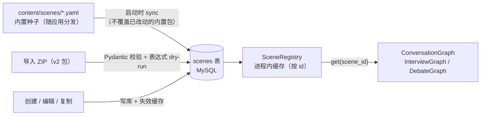
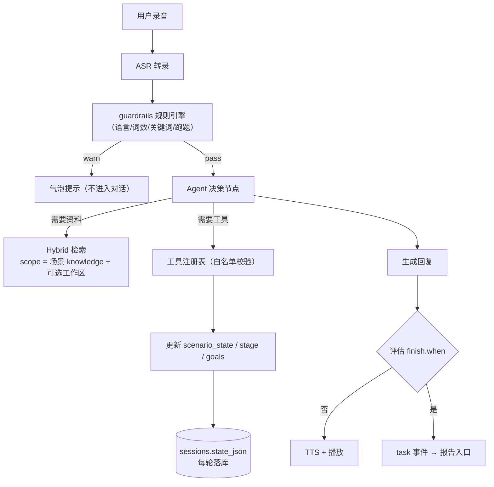
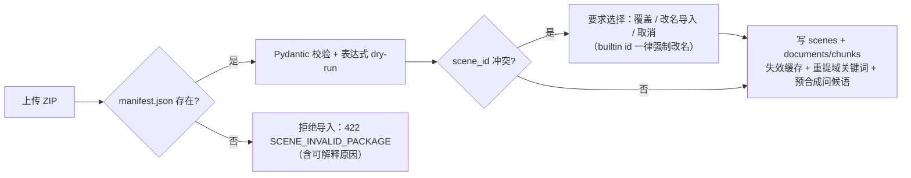

# EchoTalk 2.0 场景包设计方案

> 细化 [EchoTalk-2.0-Design.md](EchoTalk-2.0-Design.md) §8.1「场景包」，对照 1.0 实际实现给出可落地的完整设计。
>
> 版本：v1.4 · 日期：2026-09-27 · 状态：待评审
> v1.1 修订：移除 1.0 旧包兼容与云端对象存储（音频一律本地存储）；新增 §4.7 明确数字人与场景包的边界。
> v1.2 增补：新增 §13 轻量发布与社区统计（本地私有默认，发布后全员可见可下载，点赞/下载/收藏），§12 对应条目同步调整。
> v1.3 增补：新增 §13.3 探索页信息架构（收藏 tab 保留 + 排序 + 常驻分页栏）；新增 §14 创建向导的低门槛设计（state 键值编辑器替代裸 JSON）。
> v1.4 增补：难度改为中文三档（简单/普通/困难，卡片彩色标注，CEFR 旧值前端自动归档、后端校验双兼容）；引导式对话指引（场景说明 + 规则 → 自动拼装 System Prompt）；结束时机四选一卡片（轮数/目标达成/状态条件/自定义）与可视化条件构建器；目标判定下拉化。
> v1.5 修订：难度废中文名与 CEFR，改为**五级英文枚举存储**（entry/easy/normal/hard/expert，后端数据库与 ZIP 包契约统一英文，前端映射中文标签与五色 chip）；启动时一次性迁移历史值（CEFR 首字母 / 中文三档 → 新枚举）；卡片作者行与统计栏贴底对齐；点赞激活态红色、收藏激活态黄色。
> v1.6 修订：探索卡**移除封面图**（有图卡破坏网格节奏；封面保留在详情弹窗与创建向导），卡片菜单不再被 overflow 裁切；创建/编辑共用 SceneEditor，路由切换强制重挂载（修复 builtin→create 重定向后编辑空表单）；**package_json 改存校验后模型的完整 dump**（默认值显式落库，读写两端结构一致）；ID 报错人性化（后端文案去正则、前端保存前拦截），编辑模式 ID 输入禁用；详情弹窗底部操作栏固定贴底；字段标签字体统一为 13px/500。
> 关联章节：设计稿 §6（LangGraph）、§8（Tool Calling）、§12（多 Agent）、§15（数据结构）、§16（接口）、§17（评测）、§20（阶段 2/3）

## 0. 结论摘要

场景包从 1.0 的「Prompt 模板 + 知识库」升级为 2.0 的「**任务型训练场景的声明式描述**」：一个场景包 = 一份 `scene.yaml` 主清单 + 可选 `knowledge/` 资料目录，打包为 ZIP 导入导出。它声明**角色、训练目标、初始任务状态、允许工具、阶段与完成条件、知识资料、评估 rubric、护栏规则**七件事，运行时由 ConversationGraph 据此初始化状态、绑定工具、推进阶段、判定结束。

三个关键决策：

1. **纯声明式，不执行包内代码**（设计稿 §8.1：不需要通用插件执行平台）。1.0 的 `BaseScene` Python 插件体系退位：内置场景翻译为 YAML 种子；`validate_turn` 硬编码规则泛化为声明式护栏规则引擎；pipeline 中按 `scene_id` 字符串分支的 mock/纠错逻辑废除。
2. **任务状态进入会话，场景有始有终**。`scenario_state`（订单、汇报进度、面试阶段）由工具与图节点更新，每轮落库 `sessions.state_json`；`finish.when` 声明完成条件，`max_turns` 兜底，不再无限聊天。
3. **导入导出不携带向量索引二进制，也不兼容 1.0 旧包**。1.0 导出 FAISS `.index` 与 embedding 模型绑定、跨环境不可靠；2.0 导出知识源文件，导入时用当前 embedding 重建索引。2.0 是重构版本，不提供旧包导入，内置场景以包格式重新编写。

---

## 1. 1.0 场景包设计回顾（代码事实）

### 1.1 组成部分

| 部分 | 1.0 实现 | 位置 |
|---|---|---|
| 场景抽象 | `BaseScene`：`scene_id / name / description / category / default_params / system_prompt_template`，方法 `get_system_prompt()`（参数渲染）、`get_greeting()`（硬编码首句）、`validate_turn()`（交互前校验钩子）、`get_evaluation_rules()`（课后评估提示词片段） | `backend-1.0/app/scenes/base.py` |
| 加载器 | 静态注册 + `plugins/` 目录动态扫描 Python 插件；DB 自定义场景实例化为 `CustomScene`，与插件接口一致；ID 冲突时插件优先；`get_scene()` 实时读库实现编辑即时生效 | `scenes/loader.py` |
| 内置场景 | interview（面试 Sarah）、ordering（咖啡厅点餐 Leo）、meeting（商务会议 David），各含性格/店名等 `default_params`、中文与短回答提示、场景评估准则 | `scenes/plugins/*.py` |
| 数据模型 | `Scene` 表：`id / name / description / category / default_params(JSON) / system_prompt / rag_metadata(JSON) / greeting_text / greeting_audio_url / domain_keywords(JSON)` | `app/models.py` |
| 场景 RAG | 每场景独立 FAISS 索引 + chunks JSON；文档上传→解析分块→入库；`visibility` 分节（`user` 学习者可见 / `ai_only` 仅检索）；分节可见性可 PATCH | `services/rag.py`、`api/endpoints/scenes.py` |
| 导入导出 | ZIP = `scene_config.json`（配置）+ `{scene_id}.index`（FAISS 二进制）+ `{scene_id}.json`（chunks）；导入支持覆盖更新；删除级联清历史与索引 | `scenes.py` export/import/delete |
| 运行时用法 | 问候语预合成 TTS（edge-tts + 七牛 Kodo 云存储；2.0 已弃用云端对象存储，音频一律本地存储）降低首响；`validate_scene_relevance` 三级跑题检测（域关键词→向量相似度→LLM）；`extract_domain_keywords` 建场景时预提取；mock 纠错按 scene_id 字符串分支 | `services/pipeline.py` |

### 1.2 值得保留的机制（2.0 直接继承）

- **参数化 System Prompt**（`{var}` 占位符 + 用户可覆盖参数）——保留并升级为带类型的 `prompt.params`。
- **问候语预合成**（首句不经过 LLM，音频预生成）——保留，是降低首响延迟的有效手段。
- **知识分节可见性**（`user` / `ai_only`）——保留，天然匹配「学习者看菜单、AI 检索内部规范」的教学需求。
- **场景级检索隔离**（每场景独立索引，天然限定资料范围）——保留为检索 scope 的一部分。
- **域关键词跑题检测**（关键词→向量→LLM 三级）——保留策略，改为包内可配置。
- **导入导出 + 数据库自定义场景与内置场景同构**——保留整体形态。

### 1.3 2.0 要解决的问题

| # | 1.0 局限 | 2.0 目标（对应设计稿） |
|---|---|---|
| 1 | 场景只是「人设 + 提示词」，无任务状态、目标与完成条件，本质是无限聊天 | 场景有目标、进度和终点（§8.1：点餐确认后结束、会议记录三件事完成） |
| 2 | 价格计算靠提示词要求 LLM「严格按 RAG 菜单算」，易算错 | 价格与订单状态由工具程序维护（§8：`calculate_order / modify_order`） |
| 3 | `validate_turn` 每场景硬编码（中文检测、词数、可颂提示），自定义场景无法拥有这些规则 | 护栏规则声明式化，任何场景包可配置同等能力 |
| 4 | pipeline 的 mock 纠错按 `scene_id` 字符串匹配分支，加场景必改核心代码 | 场景差异全部收敛进场景包声明，pipeline 不感知具体场景 |
| 5 | 评估准则是纯文本片段，报告维度不可结构化、不可加权 | rubric 结构化（维度/权重/数据来源），任务完成度由状态程序判定 |
| 6 | 导出包含 FAISS 二进制索引，与 embedding 模型版本绑定，换模型/换环境即失效 | 导出源文件，导入重建索引；格式与存储解耦 |
| 7 | 无多角色概念（一个场景一个 AI 人设） | 面试/辩论需要多角色 + 协调（§12：Sarah/Emma/David/Evaluator） |
| 8 | 删除场景级联删除全部练习历史 | 历史是 2.0 核心资产（回放/分析），删除场景保留会话快照 |

---

## 2. 2.0 设计稿对场景包的要求（条款汇集）

| 出处 | 条款 | 对本方案的约束 |
|---|---|---|
| §8.1 | 沿用原有场景导入/导出，扩展配置：**角色、背景资料、训练目标、初始状态、允许工具、阶段与完成条件**；先 JSON/YAML，不需要通用插件执行平台 | 本方案的主体即这七项的 schema |
| §8.1 示例 | `scene: cafe_ordering / role / goals / tools / state / finish_when` | YAML 字段名与其对齐（语义等价，形态规范化） |
| §6.2 | `ConversationState.scenario_state` 保存订单规格、面试主题或辩论轮次；消息只留近期 + 摘要 | state 初始化来自场景包；会话持久化落 `state_json` |
| §8 工具表 | 工具注册表：`search_knowledge / lookup_word / get_learning_profile / calculate_order / modify_order / get_hint / add_review_task / next_interview_stage`；首批 3–5 个；参数 Pydantic 校验；重复调用保护 | 场景包只做**白名单引用**，不定义工具实现 |
| §12 | 面试角色：Coordinator（首期普通规则）、Technical、HR、Challenge、Evaluator；辩论：主持/对方/评估 | 包内 `roles` 多角色 + `coordination` 简单规则 |
| §15 | Scene 实体：角色、资料、任务、阶段、允许工具；`Session.state_json` 保存订单或面试阶段 | MySQL 表设计 |
| §16.1 | `/scenes`、`/scenes/import`、`/scenes/export` | API 路径沿用 |
| §19.1 | 迁移顺序 4：「一个场景先接 ConversationGraph，再扩展其他模式」 | 首个落地场景为 cafe_ordering |
| §5.1 | 后端结构含 `content/ 场景、课程、试卷与 rubric` | 内置场景包种子放 `backend/app/content/scenes/` |
| §14.2 | 场景探索页：三内置场景卡（点餐/会议/面试）+ 我的自定义场景 + 创建/导入导出；面试卡另有「准备资料」入口（→ 知识工作区） | 前端信息需求进 API 摘要字段 |
| §17 | 工具评测：正常、改数量、无效参数、重复调用、失败重试；状态与总额正确 | 实施完成标准 |

**现状修正**：2.0 后端已切 MySQL（非设计稿所述 SQLite→PostgreSQL 路径）。本方案将**包格式与存储层解耦**：首期 MySQL（业务数据）+ 每场景 FAISS 文件（向量）+ `rank_bm25`（词项），云端迁移 pgvector 时只换存储实现，场景包格式不变。

---

## 3. 设计原则

1. **声明优先**：能写进 YAML 的不写代码。场景包描述「是什么」，不描述「怎么跑」；执行逻辑统一在 Graph、工具注册表与规则引擎。
2. **白名单封闭**：包只能引用注册表内工具、包内声明的 state 键、语料内的资料；杜绝任意执行。
3. **有始有终**：每个场景必须有 `finish`（条件 + 轮数兜底）；没有终点的对话不进首批。
4. **程序管事实，LLM 管语言**：价格、订单、阶段推进、任务完成度由程序判定；语言质量、礼貌、表达由 LLM 按 rubric 评。
5. **不背 1.0 包袱**：不提供旧包导入兼容；1.0 验证过的有效机制以 2.0 形态重新实现（见 §1.2），内置场景以包格式重新编写。

---

## 4. 场景包格式

### 4.1 目录结构

```text
cafe_ordering.zip
├── manifest.json          # 包清单：格式标识、版本、文件清单与校验和
├── scene.yaml             # 主清单（必需，唯一必需文件）
├── knowledge/             # 场景资料（可选；md / txt / pdf）
│   ├── menu.md
│   └── staff_notes.md
└── assets/                # 可选：角色头像、预设音频等（v1 仅保留位置，不解析）
```

`manifest.json`：

```json
{
  "format": "echotalk-scene",
  "version": 2,
  "scene_id": "cafe_ordering",
  "min_app": "2.0.0",
  "files": ["scene.yaml", "knowledge/menu.md", "knowledge/staff_notes.md"],
  "checksums": {"scene.yaml": "sha256:..."}
}
```

### 4.2 scene.yaml 规范（字段总览）

| 区块 | 必填 | 作用 | 1.0 对应 |
|---|---|---|---|
| `meta` | ✅ | ID、名称、描述、分类、难度、模式、版本、兼容性 | `Scene.id/name/description/category` |
| `roles` | ✅ | 角色列表（1–4 个），含性格、声音、形象推荐 | `default_params.personality/interviewer_name` 等 |
| `prompt` | ✅ | System Prompt 模板、问候语、可覆盖参数（带类型） | `system_prompt / greeting_text / default_params` |
| `objectives` | ✅ | 训练目标，关联 Skill Graph，可配程序化达成判定 | 无（新增） |
| `state` | ✅ | 初始 `scenario_state`（任务状态） | 无（新增，§8.1 `state`） |
| `tools` | ✅ | 允许工具白名单 + 工具静态配置 | 无（新增，§8.1 `tools`） |
| `stages` | ➖ | 阶段定义与推进条件 | 无（新增） |
| `finish` | ✅ | 完成条件 + 轮数兜底 + 结束动作 | 无（新增，§8.1 `finish_when`） |
| `knowledge` | ➖ | 资料清单、可见性、检索参数 | `rag_metadata` + 上传流程 |
| `evaluation` | ➖ | 结构化 rubric + 场景评估备注 | `get_evaluation_rules()` |
| `guardrails` | ➖ | 语言、词数、关键词提示、跑题检测 | `validate_turn()` + `domain_keywords` |
| `avatar` | ➖ | 数字人形象与声音推荐（与包的边界见 §4.7） | 无 |

校验（保存/导入时以 Pydantic 模型执行，详见 §9）：
- `meta.id` 匹配 `^[a-z][a-z0-9_]{1,49}$`；`category ∈ {daily, business, career, academic, custom}`（对应参考稿徽标：日常沟通/职场沟通/求职训练…）；`difficulty ∈ {entry, easy, normal, hard, expert}`（五级英文枚举，v1.5 起为唯一合法值，大小写归一；历史 CEFR/中文值由启动迁移归一）；`mode ∈ {conversation, interview, debate}`。
- `tools.allowed` ⊆ 工具注册表；`tools.config` 的键 ⊆ `allowed`。
- `objectives[].check` 与 `finish.when`、`stages[].exit_when` 中的表达式须通过 dry-run 解析（引用的 state 路径必须存在于 `state` 初始值或运行时保留键）。
- `prompt.system` 中 `{param}` 占位符必须能在 `params` 或内置变量（`{roles.<id>.<field>}`）中解析。

### 4.3 完整示例：cafe_ordering

> 由 1.0 `OrderingScene` 插件翻译升级，是 2.0 首个接入 ConversationGraph 的场景（设计稿 §19.1 迁移顺序 4、§1.3 Agent 演示路径）。

```yaml
meta:
  id: cafe_ordering
  name: 繁忙咖啡厅点餐 (Cafe Ordering)
  description: 在纽约街头咖啡馆点一份早餐与咖啡，练习日常口语、定制化订单与结账表达。
  category: daily
  difficulty: easy
  mode: conversation
  version: 2
  compat:
    min_app: 2.0.0
  author: builtin
  tags: [礼貌表达, 订单工具, 日常沟通]

roles:
  - id: barista
    display_name: Leo
    title: Barista
    personality: friendly but busy
    voice: en-US-YoungMale        # 可选：TTS 声音推荐
    avatar: leo_2d                # 可选：数字人形象推荐

prompt:
  # 占位符来源：{param} ← prompt.params；{roles.<id>.<field>} ← roles
  system: |
    You are {roles.barista.display_name}, a {roles.barista.personality} barista at {store_name} in New York.
    The customer (user) is ordering drinks or food. Ask for preferences like cup size
    (small, medium, large), milk choices (oat, almond, skim, whole), or to-go/for-here.
    IMPORTANT: Today we are completely out of {out_of_stock_item}. If the customer asks for it,
    apologize politely and recommend blueberry muffins or chocolate bagels instead.
    When prices or order changes are involved, ALWAYS call the calculate_order / modify_order
    tools instead of computing by yourself. Never invent prices.
    To simulate a busy morning queue, keep your responses extremely short (1 sentence, max 15 words).
  greeting: |
    Hi there! Welcome to {store_name}. It's a pretty busy morning!
    What can I get started for you today?
  params:
    - key: store_name
      type: string
      default: Metro Cafe
      editable: true
    - key: out_of_stock_item
      type: string
      default: croissants
      editable: true
      tip: 缺货商品，用于练习应变表达

objectives:
  - id: polite_request
    label: 礼貌提出请求
    skill: speaking.politeness            # 关联 Skill Graph（设计稿 §9.3）
  - id: quantity_preference
    label: 表达数量与规格
    skill: speaking.task_completion
    check: tool_called('modify_order')    # 程序化达成判定（事件谓词）
  - id: confirmation
    label: 复述并确认订单
    skill: speaking.task_completion
    check: state.confirmed == true

state:                                    # 初始 scenario_state（会话创建时深拷贝）
  order: []                               # 由 modify_order 维护：[{item, size, milk, qty, unit_price}]
  confirmed: false
  paid: false

tools:
  allowed: [calculate_order, modify_order, search_knowledge, lookup_word, get_hint]
  config:
    calculate_order:
      price_source: knowledge:menu.md     # 价格事实来自菜单资料，程序计算

stages:                                   # 简单场景的阶段是软引导，不强制
  - id: greeting
    name: 进店问候
  - id: ordering
    name: 点单与定制
    guidance: 依次确认饮品、规格、奶类与堂食/带走
  - id: checkout
    name: 确认与支付
    guidance: 复述完整订单、计算总额并询问支付方式
    exit_when: state.confirmed == true

finish:
  when: state.confirmed == true and state.paid == true
  max_turns: 30                           # 兜底，防无限聊天
  on_finish: request_feedback             # 结束动作：邀请结束并生成报告

knowledge:
  files:
    - path: menu.md
      visibility: user                    # 学习者可见（对话页参考面板）
      sections: [drinks, pastries, prices]
    - path: staff_notes.md
      visibility: ai_only                 # 库存告警等内部规范，仅检索不展示
  retrieval:
    default_top_k: 4

evaluation:
  dimensions:
    - id: task_completion
      label: 任务完成度
      weight: 0.4
      source: state                       # 程序从任务状态计算（订单完成/修改成功）
    - id: politeness
      label: 礼貌与得体
      weight: 0.2
      source: llm
      hints: [would you, could I, may I, please]
    - id: accuracy
      label: 语法与用词
      weight: 0.4
      source: llm
  notes: |                                # 1.0 get_evaluation_rules 的保留形态
    重点关注：定制细节表达（加冰、脱脂奶、加热）；缺货时的应变；结账与打包用语。

guardrails:
  language: en                            # 检测连续中文时提示（源自 1.0 interview 规则）
  min_words: 3                            # 低于词数提示丰富回答（源自 1.0 规则）
  keyword_tips:                           # 关键词教学提示（源自 1.0 可颂规则）
    - match: croissant
      tip: 小贴士：今天店里的可颂已经售罄，可以练习更换点单或取消的表达。
  off_topic:
    domain_keywords: [coffee, latte, muffin, bagel, order, size, milk, pay]
    action: warn                          # warn：气泡提示不阻断；缺省关键词时导入自动提取
  max_warnings_per_turn: 1

avatar:
  preferred: leo_2d
  rate: 1.0
```

### 4.4 示例二：launch_alignment（会议，展示 state 目标化）

```yaml
meta:
  id: launch_alignment
  name: 产品发布会同步会议 (Business Meeting)
  description: 参与跨国项目组的产品发布准备会议，讨论进度延误、解决方案与任务分工。
  category: business
  difficulty: B1-B2
  mode: conversation
roles:
  - id: chair
    display_name: David
    title: Product Manager
    personality: result-oriented and collaborative
prompt:
  system: |
    You are {roles.chair.display_name}, the Product Manager leading a Q3 product launch
    alignment meeting. The user is a frontend developer on your team. Speak professionally,
    using polite but direct business English. Ask about progress, reasons for the delay,
    blockages, and potential solutions. Keep responses concise (1-2 sentences), one question
    at a time. When the meeting reaches a milestone (progress reported / issue clarified /
    next step confirmed), call update_scene_state to record it.
  greeting: |
    Hi team, thanks for joining. Let's get straight to the point — we are here to align on
    the Q3 product launch. Could you explain the current status on your side and what main
    blockages are causing the delay?
state:                          # 设计稿 §8.1：会议记录「三件事」
  reported: false               # 汇报已完成
  clarified: false              # 问题已澄清
  next_step: null               # 下一步已确认
objectives:
  - id: status_report
    label: 清晰汇报进度与阻塞
    skill: speaking.report
    check: state.reported == true
  - id: clarification
    label: 主动澄清与确认
    skill: speaking.clarification
    check: state.clarified == true
  - id: alignment
    label: 协商并确认下一步
    skill: speaking.negotiation
    check: state.next_step != null
tools:
  allowed: [update_scene_state, search_knowledge, lookup_word, get_hint]
finish:
  when: state.reported and state.clarified and state.next_step != null
  max_turns: 25
guardrails:
  language: en
  min_words: 4
```

> 会议这类「轻量状态」场景用通用工具 `update_scene_state`（受限：只能写包内声明的 state 键，改动记入工具轨迹）；点餐这类「强事实」场景用专用工具（`modify_order` 带价格重算与重复调用保护）。

### 4.5 示例三：tech_interview（面试，展示多角色与阶段）

```yaml
meta:
  id: tech_interview
  name: 软件工程师面试 (Job Interview)
  description: 模拟外企软件工程师英文技术面试，考察专业术语、沟通能力与逻辑表达。
  category: career
  difficulty: B1-C1
  mode: interview              # 加载 InterviewGraph（设计稿 §12.1）
roles:
  - id: tech
    display_name: Sarah
    title: Technical Interviewer
    personality: professional and slightly strict
  - id: coach
    display_name: Evaluator
    backstage: true             # 不参与对话，仅课后报告（§12.1 Evaluator）
coordination:                   # 首期单角色出声（§21.1 求职路径）；HR/Challenge 加入后扩展 order
  order: [tech]
prompt:
  system: |
    You are {roles.tech.display_name}, a {roles.tech.personality} senior engineering manager.
    Ask technical and behavioral questions, one at a time, concise (1-2 sentences).
    In project deep-dive, ALWAYS search_knowledge first and ground your question in the
    candidate's resume / JD / project docs; follow up on specific claims from their last answer.
tools:
  allowed: [search_knowledge, next_interview_stage, get_hint, add_review_task]
stages:                         # 阶段推进由 next_interview_stage 工具显式驱动
  - id: intro                   # 自我介绍
  - id: project_deep_dive       # 项目深挖（问题必须引用资料）
  - id: tradeoffs               # 技术取舍
  - id: behavioral              # 行为题
  - id: candidate_questions     # 候选人提问
finish:
  when: stage == 'candidate_questions' and stage_turns >= 2
  max_turns: 40
knowledge:
  files:
    - path: resume.pdf
      visibility: ai_only       # 简历只供面试官检索，不展示给学习者
    - path: jd.md
      visibility: ai_only
guardrails:
  language: en
  min_words: 3
```

辩论模式（`mode: debate`）与面试同构：`roles` 为 主持/对方/评估，`coordination.order` 按回合轮转，`state` 记录 `round / stance / deadline`，首批不内置、仅保证 schema 兼容。

### 4.6 条件表达式子语言

`finish.when`、`stages[].exit_when`、`objectives[].check` 使用同一套**白名单表达式**（设计稿 §8.1 的 `finish_when: user_confirmed_order` 是其语义示意；具名谓词可在包内定义别名，v1 可不实现）：

```text
表达式 := 或表达式
或表达式 := 与表达式 ('or' 与表达式)*
与表达式 := 非表达式 ('and' 非表达式)*
非表达式 := 'not' 非表达式 | 比较
比较 := 操作数 (('=='|'!='|'>='|'<='|'>'|'<'|'in') 操作数)?
操作数 := 字面量 | 引用 | 函数
字面量 := true | false | null | 数字 | '单引号字符串'
引用 := state.<路径> | stage | stage_turns | turn_count
函数 := tool_called('工具名') | state_changed('state路径') | goals_done()
```

- `state.<路径>`：JSON 路径，支持 `.` 与 `[n]`（如 `state.order[0].size`）；只能引用**包内声明的键**与运行时保留键。
- 保留键（运行时由图写入，包不可声明）：`stage`（当前阶段 id）、`stage_turns`（当前阶段轮数）、`turn_count`（总轮数）。
- 实现：Python `ast` 解析 + 节点类型白名单（禁止属性访问/调用任意对象/下标越界访问包外数据），保存与导入时 dry-run，运行时每轮工具执行后求值。
- 表达式求值结果与依据（哪个条件首次满足）写入会话轨迹，报告可回溯「场景为何结束」。

### 4.7 数字人与场景包的边界

**结论：数字人不作为场景包的组成部分，包内只携带推荐值。**

| 层 | 归属 | 说明 |
|---|---|---|
| 角色 → 形象/声音的推荐 | 场景包 | `roles[].avatar / voice` 与 `avatar.preferred / rate`，均为可选字段 |
| 形象资产、声音与语速配置 | 数字人模块（用户级） | 角色页 / 设置页管理（设计稿 §13）；资产存本地，不入包 |
| 实际渲染 | 前端 AvatarStage | 优先级：用户偏好 > 包推荐 > 应用缺省 |

理由：

1. **职责分离**：场景包是训练任务的声明（教学内容），数字人是呈现层（§13）；同一场景换形象不应改动训练内容。
2. **可移植性**：2D/3D 模型与音频资产体积大、许可复杂，入包会让 ZIP 膨胀并限制分发；`voice` 只是风格描述（如 `en-US-YoungMale`），运行时映射到当前可用的 TTS 渠道。
3. **用户优先**：包推荐只是作者建议，用户在角色页的选择始终覆盖它，避免不同场景包互相改写用户配置。
4. **阶段匹配**：数字人 2D 在阶段 7 落地（§20），场景包在阶段 2–3；`assets/` 目录 v1 只保留位置与透传。

因此 `avatar` 区块保持**可选且无副作用**：缺失时用应用缺省形象；校验只检查引用格式，不要求资产存在。

---

## 5. 运行时设计

### 5.1 SceneRegistry（加载、缓存、种子同步）



- **内置场景也入库**（`source=builtin`，seed 来自 `backend/app/content/scenes/`），与自定义场景同构——统一查询、统一接口，比 1.0 的「插件优先 + DB 补充」规则简单。
- **内置场景只读**：不可编辑、不可删除；「复制为自定义」后可改（参考稿「我的自定义场景」分区与此一致）。应用升级时种子按 `meta.version` 更新未被改动过的内置行。
- 保留 1.0 的实时性思路：写操作直接失效缓存，`get(scene_id)` 每次读内存缓存、未命中回源 DB，编辑即时生效。
- 注册表输出两种形态：`ScenePackage`（完整包，给 Graph/校验）与 `SceneSummary`（列表摘要，给前端：分类、难度、标签、目标数、资料数、模式、来源）。

### 5.2 与 LangGraph 对接

会话创建时（`POST /sessions {scene_id}`）：

1. `Registry.get()` 取包 → Pydantic 再校验一次（防止 DB 脏数据）。
2. **初始化 `ConversationState`**（对齐设计稿 §6.2）：`scenario_state` = 包 `state` 深拷贝 + 保留键初值；`learner_summary` 来自 Memory；`current_stage` = 首阶段。
3. **渲染 System Prompt**：`{param}`（默认值或用户偏好覆盖）+ `{roles.*}` + 自动追加「目标与阶段指引」段（由 `objectives`/`stages.guidance` 生成）与「允许工具使用说明」段。
4. **绑定工具**：`tools.allowed` → 工具注册表取实现 → `model.bind_tools()`；工具读取 `tools.config` 静态配置与 `scenario_state`。

每轮循环中的场景包职责：



- **阶段推进**双通道：声明式 `exit_when`（conversation 类，图节点每轮评估）与工具驱动（interview 类，`next_interview_stage` 显式改 `stage`，图感知后更新提示）。阶段变化通过 SSE `task` 事件通知前端 TaskPanel（§7.4）。
- **目标进度**：`objectives[].check` 在相关事件后求值（工具调用/state 变更），达成即记 `goals_json` 并推送；无 `check` 的目标在报告时由 LLM 按 rubric 判定。
- **完成判定**：每轮工具执行与状态更新后评估 `finish.when`；满足 → 进入 finish 节点 → `on_finish`（`request_feedback`：AI 收尾 + 前端报告入口）；`turn_count >= max_turns` → Coach 委婉收束。判定依据写入轨迹。
- **持久化**：首期用业务表 `sessions.state_json` 每轮落库（重启后从 `state_json` 重建 `ConversationState` 继续训练，满足设计稿 §6.3「关闭应用后仍可读历史与恢复阶段」）；LangGraph checkpoint（SqliteSaver）作为阶段 2 后期的可选增强，不阻塞主路径。

### 5.3 guardrails：声明式规则引擎

取代 1.0 `validate_turn()` 每场景硬编码与 `pipeline` 的 `scene_id` 字符串分支。通用规则引擎读取包配置，在用户转录进入 Graph 前执行：

| 规则 | 1.0 出处 | 2.0 配置 | 动作 |
|---|---|---|---|
| 语言检测 | interview 插件：连续 3+ 汉字提示 | `language: en` | `warn`：气泡提示（不修改输入） |
| 最少词数 | interview/meeting 插件：词数 < 3/4 提示 | `min_words: n` | `warn`：建议丰富回答 |
| 关键词提示 | ordering 插件：点 croissant 提示售罄 | `keyword_tips: [{match, tip}]` | `warn`：教学提示 |
| 跑题检测 | `validate_scene_relevance` 三级（域关键词→向量→LLM） | `off_topic: {domain_keywords, action}` | `warn`（默认）；关键词缺省时导入自动提取（沿用 `extract_domain_keywords` 思路） |

规则输出统一为 `{rule, level, message}`；`warn` 不阻断、不修改用户输入（1.0 的 `modified_input` 机制废弃——修改用户话语有教学诚实性问题）；连续告警受 `max_warnings_per_turn` 限制避免刷屏。未来扩展 `coach` 动作（Agent 顺势引导）时不改包格式。

### 5.4 知识检索范围

- 场景包 `knowledge/` 上传后进入场景 scope（沿用 1.0 每场景隔离），向量（FAISS 文件）+ 词项（`rank_bm25`）双路召回 + RRF 融合（设计稿 §7.1）；chunks 元数据（文件、分节、可见性、序号）存 MySQL。
- 检索 scope = 场景 knowledge；面试类场景叠加用户工作区资料（简历/JD/项目，设计稿 §12.1「资料驱动」），由 `mode` 与会话参数决定。
- `visibility` 分节沿用 1.0：`user` 分节在对话页参考面板展示，`ai_only` 仅参与检索。
- `retrieval.default_top_k` 为场景级缺省（3–5），用户偏好可覆盖。

### 5.5 问候语预合成

场景创建/导入/编辑问候语时，后台任务用 TTS 预合成首句音频并存储。**音频一律本地存储**：写入应用数据目录（如 `backend/storage/audio/greetings/`，按场景 id 分目录、文件名含参数组合哈希），经 FastAPI 静态挂载以 `/static/audio/...` 下发，数据表只存相对路径。会话启动直接下发 `{text, audio_url}`，不经 LLM，保住首响延迟；`{param}` 变化时按参数组合缓存。

---

## 6. 数据模型（MySQL）

```sql
-- 场景包（完整声明存 package_json，列出的标量列仅为查询/展示冗余）
CREATE TABLE scenes (
  id             VARCHAR(50)  PRIMARY KEY,             -- meta.id
  name           VARCHAR(100) NOT NULL,
  description    TEXT,
  category       VARCHAR(30)  NOT NULL DEFAULT 'custom',
  mode           VARCHAR(20)  NOT NULL DEFAULT 'conversation',
  difficulty     VARCHAR(20)  NULL,                    -- 五级英文枚举 entry/easy/normal/hard/expert
  package_json   JSON         NOT NULL,                -- 完整 scene.yaml 解析结果
  source         VARCHAR(20)  NOT NULL DEFAULT 'custom',  -- builtin | custom | imported
  pkg_version    INT          NOT NULL DEFAULT 2,      -- 包结构版本
  author_id      INT          NULL,                    -- FK users.id（builtin 为 NULL）
  greeting_text  TEXT         NULL,
  greeting_audio_path VARCHAR(512) NULL,               -- 预合成音频本地相对路径（/static/audio/...）
  domain_keywords JSON        NULL,                    -- 跑题检测预提取（缺省自动填充）
  created_at     DATETIME     NOT NULL,
  updated_at     DATETIME     NOT NULL,
  INDEX idx_scenes_source (source),
  CONSTRAINT fk_scenes_author FOREIGN KEY (author_id) REFERENCES users(id)
);

-- 知识资料（1.0 rag_metadata 升级为实体；向量索引仍在磁盘 FAISS 文件，重建即得）
CREATE TABLE documents (
  id          BIGINT PRIMARY KEY AUTO_INCREMENT,
  scene_id    VARCHAR(50) NOT NULL,
  owner_id    INT NULL,                       -- 上传者；builtin 资料为 NULL
  filename    VARCHAR(255) NOT NULL,
  content_type VARCHAR(100) NULL,
  chunk_count INT NOT NULL DEFAULT 0,
  visibility  VARCHAR(10) NOT NULL DEFAULT 'user',   -- 文件级缺省，可被分节覆盖
  created_at  DATETIME NOT NULL,
  CONSTRAINT fk_documents_scene FOREIGN KEY (scene_id) REFERENCES scenes(id) ON DELETE CASCADE
);
CREATE TABLE chunks (
  id          BIGINT PRIMARY KEY AUTO_INCREMENT,
  document_id BIGINT NOT NULL,
  scene_id    VARCHAR(50) NOT NULL,           -- 冗余，便于按场景重建索引
  section     VARCHAR(100) NULL,              -- 分节名（1.0 已有概念）
  visibility  VARCHAR(10) NOT NULL DEFAULT 'user',
  ordinal     INT NOT NULL,
  text        MEDIUMTEXT NOT NULL,
  meta_json   JSON NULL,                      -- 标题/页码等来源信息
  CONSTRAINT fk_chunks_document FOREIGN KEY (document_id) REFERENCES documents(id) ON DELETE CASCADE,
  INDEX idx_chunks_scene (scene_id, section)
);

-- 会话（设计稿 §15；scenario_state 每轮落库）
CREATE TABLE sessions (
  id            BIGINT PRIMARY KEY AUTO_INCREMENT,
  user_id       INT NOT NULL,
  scene_id      VARCHAR(50) NULL,             -- 场景删除后置 NULL，靠快照回放
  scene_name    VARCHAR(100) NOT NULL,        -- 场景快照（回放用）
  scene_snapshot_json JSON NULL,              -- 轻量快照：角色/模式/rubric 摘要
  mode          VARCHAR(20) NOT NULL,
  state_json    JSON NULL,                    -- scenario_state + 保留键
  goals_json    JSON NULL,                    -- 目标进度
  stage         VARCHAR(50) NULL,
  started_at    DATETIME NOT NULL,
  finished_at   DATETIME NULL,
  CONSTRAINT fk_sessions_user FOREIGN KEY (user_id) REFERENCES users(id),
  CONSTRAINT fk_sessions_scene FOREIGN KEY (scene_id) REFERENCES scenes(id) ON DELETE SET NULL
);
```

与 1.0 的差异决策：

| 决策 | 1.0 | 2.0 | 理由 |
|---|---|---|---|
| 内置场景存储 | 不入库，Python 插件优先 | 入库（source=builtin，只读+可复制） | 统一同构，简化加载规则 |
| 删除场景 | 级联删除全部历史 | `ON DELETE SET NULL` + 会话快照 | 历史回放/分析是 2.0 核心资产 |
| 知识元数据 | `rag_metadata` JSON 列 | `documents / chunks` 实体表 | 可按文件/分节管理、可见性更新、重建索引 |
| 向量索引 | 随包导出 `.index` 二进制 | 仅运行时产物，导入重建 | 与 embedding 模型解耦 |
| 评估配置 | 无（代码内字符串） | `package_json.evaluation` rubric | 结构化、可加权、报告可追溯 |

---

## 7. API 设计

沿用设计稿 §16.1 路径形态（`/scenes`、`/scenes/import`、`/scenes/export`），按 2.0 账户体系加鉴权（builtin 对所有人可见，custom 仅本人）。

| 方法与路径 | 用途 | 备注 |
|---|---|---|
| `GET /scenes` | 列表（builtin + 本人 custom），返回 `SceneSummary` | 含分类/难度/标签/目标数/资料数/模式，供场景卡 |
| `GET /scenes/templates` | 内置模板列表（= builtin 包摘要） | 「从模板创建」入口 |
| `POST /scenes` | 创建自定义场景（body = 完整包字段） | 保存前 Pydantic + 表达式 dry-run 校验 |
| `POST /scenes/from-template` | 从模板复制创建（`{template_id, new_id?}`） | 内置场景只读的替代路径 |
| `GET /scenes/{id}` | 详情：完整包 + 资料元数据 | `ai_only` 分节内容不随详情下发 |
| `PUT /scenes/{id}` | 更新自定义场景 | builtin 返回 `409`；问候语变更触发重合成 |
| `POST /scenes/{id}/duplicate` | 复制 | |
| `DELETE /scenes/{id}` | 删除自定义场景 | sessions 解绑并留快照；级联清 documents/chunks 与索引文件 |
| `POST /scenes/validate` | 干跑校验（编辑器实时用） | 返回字段级错误与表达式解析错误 |
| `POST /scenes/{id}/knowledge` | 上传资料文件（multipart） | 替代 1.0 `/{id}/upload`；pdf/txt/md；解析→分块→入库→更新索引 |
| `DELETE /scenes/{id}/knowledge/{document_id}` | 删除单个资料 | 1.0 只能全清，2.0 支持单文件 |
| `GET /scenes/{id}/knowledge` | 学习者可见分节内容 | 沿用 1.0 |
| `GET /scenes/{id}/knowledge/sections` | 全分节概览（含 visibility） | 沿用 1.0 |
| `PATCH /scenes/{id}/knowledge/sections/{name}` | 修改分节可见性 | 沿用 1.0 |
| `POST /scenes/{id}/query` | 场景 scope 检索测试（调试） | 沿用 1.0；升级为 Hybrid 返回 |
| `POST /scenes/import` | 导入 ZIP（仅 §4 包格式） | 见 §8 |
| `GET /scenes/{id}/export` | 导出 ZIP（v2 格式） | 见 §8 |

**SSE 事件扩展建议**（对设计稿 §16.2 类型表的补充）：新增 `task` 事件类型，载荷 `{stage, stage_name, goals: [{id, done}], finished, reason}`，供对话页 TaskPanel（设计稿 §14.4）实时渲染任务进度与完成态。工具轨迹仍走 `tool_result`。

---

## 8. 导入导出

### 8.1 导出格式

即 §4.1 目录结构：`manifest.json` + `scene.yaml` + `knowledge/` 源文件（+ 可选 `assets/`）。**不包含**任何向量索引、数据库 dump 或用户数据。`ai_only` 与 `user` 资料都导出（可见性是包作者的教学设计，不是用户隐私）；但面试场景中**用户个人上传**的简历/JD 属于工作区资料，不在场景包内，天然不随包传播。

### 8.2 导入流程



- **不提供 1.0 旧包导入**：2.0 为重构版本，旧 ZIP（`scene_config.json` + FAISS 索引）一律拒绝并返回可解释错误；内置三场景已按包格式重新编写，无需从旧包迁移。
- 导入不携带任何向量索引：knowledge 由包内源文件解析重建，索引用当前 embedding 生成（与模型版本解耦）。

---

## 9. 安全与校验

1. **无代码执行**：包内只有数据文件。Python 插件动态扫描（`importlib`）机制整体移除——这是 1.0→2.0 最重要的攻击面收缩，也符合设计稿 §8.1「不需要通用插件执行平台」。
2. **Pydantic 全量校验**：创建、编辑、导入三入口共用同一 `ScenePackage` 模型；`POST /scenes/validate` 供编辑器实时反馈。
3. **表达式白名单求值**：`ast` 节点白名单（§4.6），禁止属性访问与任意调用；引用的 state 键必须包内声明。
4. **工具白名单**：`tools.allowed` ⊆ 注册表；未注册工具名在校验期报错。工具参数 Pydantic 校验、重复调用保护、轨迹脱敏（设计稿 §8）在工具层实现，与包无关。
5. **资料类型与大小**：`pdf / txt / md / markdown`，单文件大小上限（建议 10 MB）与总 chunk 数上限；解析失败返回可解释错误。
6. **权限**：builtin 全员只读；custom/imported 仅 `author_id` 本人可写、可导出；检索 scope 严格按 scene_id 隔离（继承 1.0）。
7. **导入覆盖确认**：`scene_id` 冲突必须显式选择（覆盖/改名/取消），不静默覆盖。

---

## 10. 与其他模块的衔接

| 模块 | 衔接点 |
|---|---|
| Memory / 学习画像（§9） | `objectives[].skill` 关联 Skill Graph 节点；报告按 rubric 产出后，达成/未达成目标写入 `LearningProfile` 与 `ReviewTask`；`get_learning_profile` 工具可在对话中读取画像调整引导 |
| 训练报告（§15 Report） | `evaluation.dimensions` 决定报告维度与权重；`source: state` 维度由程序从 `scenario_state` 计算（订单是否正确完成、三件事是否达成），`source: llm` 维度由 LearningGraph 按 `notes/hints` 评；报告引用结束依据（finish 判定轨迹） |
| 今日训练（§14.2） | 场景 `meta.tags / difficulty / category` 进入推荐信号；「场景迁移表达」推荐引用场景 id |
| 模拟面试 / 辩论（§12） | `mode: interview/debate` 决定加载 Interview/Debate 子图；`roles.backstage` 标记 Evaluator；`coordination.order` 是首期 Coordinator 规则；简历/JD 资料走工作区叠加（§5.4） |
| 数字人（§13） | 数字人**不作为包的组成部分**（§4.7）：`roles[].avatar / voice` 与 `avatar.preferred / rate` 仅为推荐值；实际形象/声音/语速由用户偏好决定，优先级 用户偏好 > 包推荐 > 应用缺省 |
| 知识工作区（§14.2） | 场景 knowledge 是工作区的子视图（按 scene 过滤）；面试卡的「准备资料」直接跳工作区并预选 scope |
| 前端场景探索页 | 卡片信息 = `SceneSummary`；创建向导（表单分步：角色→目标→资料→规则）产出包字段；高级模式可直接编辑 YAML（经 `POST /scenes/validate` 校验）；导入按钮仅接受 §4 包格式 |
| 历史回放（§14.2） | 回放读取 `sessions.scene_snapshot_json + state_json`，场景已删除也可完整回放任务进度 |

---

## 11. 实施计划与完成标准

对齐设计稿 §20 阶段 2（LangGraph 与 Tool Calling）与阶段 3（Hybrid RAG），以及 §23 任务 4/5。步骤间有依赖，S1→S2→S3→S4 串行，S5/S6 可与 S4 并行，S7 在 S2 后即可开工。

| 步骤 | 内容 | 产出与验收 |
|---|---|---|
| S1 | `ScenePackage` Pydantic 模型 + 表达式求值器 + 三内置场景 YAML 化（§4.3–4.5 全文）+ 单测 | 三包加载校验通过；表达式求值单测覆盖文法各分支与非法输入 |
| S2 | `scenes/documents/chunks` 表 + Registry（种子同步/缓存/只读规则）+ CRUD/templates/duplicate/validate API | 接口契约测试；builtin 不可改删、custom 隔离 |
| S3 | ConversationGraph 接包：state 初始化、prompt 渲染、工具白名单绑定、guardrails 规则引擎 | cafe_ordering 全链路：改数量→工具执行→state/UI/回复同步变化 |
| S4 | `finish.when` 评估 + 阶段推进（双通道）+ `sessions.state_json` 持久化 + SSE `task` 事件 | 确认订单后场景正确结束并出报告入口；重启恢复阶段 |
| S5 | knowledge 上传/删除/可见性 + 场景 scope Hybrid 检索（FAISS 基线 + BM25 + RRF） | 回复引用带来源；1.0 分节能力回归 |
| S6 | export / import（仅 §4 包格式）+ 冲突与损坏包回归测试 | 合法包导入后对话与检索可用；非法或旧格式包拒绝并可解释 |
| S7 | 前端场景探索页 + 创建向导 + 知识管理 + TaskPanel 任务渲染 | 对齐参考稿 14.2；示例数据有「示例」标识 |

**评测样例**（并入设计稿 §17 固定样例集）：三内置包 schema 校验快照；表达式 30 条（含 5 条非法）；cafe_ordering 工具场景 8 条（正常点单/改数量/改规格/无效参数/重复调用/缺货应变/确认结束/超轮兜底）；非法/损坏包拒绝 2 例；跑题检测 6 条（域内/域外/边界）。

**求职演示价值**（设计稿 §1.2/§21）：本方案直接产出「订单修改前后状态、工具参数/结果、失败与重试轨迹」「场景包 schema 校验与导入冲突处理」两类岗位证据。

---

## 12. 明确不做的事

- **包内代码执行 / 插件运行时**（设计稿 §8.1 明确排除；1.0 的 `importlib` 动态扫描不继承）。
- **可视化场景编排器**：创建向导是表单，不是画布。
- **场景市场 / 分享平台**：导入导出 + 轻量发布（§13）已满足个人分发，不做在线仓库、评论与排行榜。
- **复杂条件 DSL 扩展**（循环、算术、自定义函数）：白名单表达式足够，需求出现再议。
- **辩论内置场景**：schema 预留（`mode: debate`），内容随阶段 6 落地。
- **assets/ 解析**（头像、预设音频）：v1 只保留目录位置与透传，数字人模块就绪后再接。
- **1.0 旧包导入兼容**：重构版本不做旧格式转换；旧 ZIP 导入返回 `SCENE_INVALID_PACKAGE` 并说明原因（见 §8.2）。

---

## 13. 轻量发布与社区统计（v1.2 增补）

**定位**：不是市场，是「包的可见性开关 + 三个计数器」。自定义场景默认**本地私有**（仅作者可见）；作者可**发布**，发布后所有用户可浏览详情、下载 ZIP（走既有导入流程），作者随时可取消发布。

### 13.1 数据模型

```sql
ALTER scenes ADD COLUMN status       VARCHAR(20) NOT NULL DEFAULT 'private';  -- private | published（builtin 恒公开）
ALTER scenes ADD COLUMN published_at DATETIME NULL;

CREATE TABLE scene_stats (          -- 计数器（1 行对应 1 个场景）
  scene_id   VARCHAR(50) PRIMARY KEY,
  likes      INT NOT NULL DEFAULT 0,
  downloads  INT NOT NULL DEFAULT 0,
  favorites  INT NOT NULL DEFAULT 0,
  updated_at DATETIME NOT NULL
);
CREATE TABLE scene_user_stats (     -- 一人一票（去重点赞/收藏）
  id         BIGINT PRIMARY KEY AUTO_INCREMENT,
  scene_id   VARCHAR(50) NOT NULL,
  user_id    INT NOT NULL,
  liked      INT NOT NULL DEFAULT 0,
  favorited  INT NOT NULL DEFAULT 0,
  updated_at DATETIME NOT NULL,
  UNIQUE KEY uq_scene_user (scene_id, user_id)
);
```

### 13.2 接口与可见性规则

| 方法与路径 | 用途 |
|---|---|
| `POST /scenes/{id}/publish` | 发布（仅作者；builtin 恒公开无需发布） |
| `POST /scenes/{id}/unpublish` | 取消发布（回到私有；统计保留，再发布继续累计） |
| `POST /scenes/{id}/like` | 点赞/取消（去重） |
| `POST /scenes/{id}/favorite` | 收藏/取消（去重） |

- 可见性：builtin 全员；本人场景全部；**他人仅 published**。
- 下载量 = 非作者导出 ZIP 的次数（作者导出自己不计）。
- `SceneSummary` 扩展 `status` 与 `stats {likes, downloads, favorites, liked, favorited}`。
- 取消发布不改他人已导入的副本（导入即独立）；发布不复制数据，始终是同一份包。

### 13.3 探索页信息架构（v1.3 增补）

**收藏的价值判断**：保留收藏。收藏是唯一「以用户为中心」的信号（点赞/下载都是以场景为中心），承担两个职责——①个人常用场景的快捷入口（来源筛选新增「收藏」tab，客户端按 `stats.favorited` 过滤）；②热度排序的权重项。删除收藏会同时失去这两点，且已有数据模型支持，无额外成本。

- **来源筛选 tab**：全部 / 内置 / 我的 / 社区 / **收藏**（各 tab 计数独立计算）。
- **排序**（客户端，`SceneSummary` 已含所需字段，无需新接口）：
  | 选项 | 规则 |
  |---|---|
  | 热度最高（默认） | `likes×3 + favorites×2 + downloads`，同分按创建时间新者优先 |
  | 最新创建 | `created_at` 降序 |
  | 下载最多 | `downloads` 降序，热度作次序 |
  | 收藏最多 | `favorites` 降序，热度作次序 |
- **分页栏常驻底部**：显示「共 N 个场景 · 第 x / y 页」，单页时上下页按钮禁用但不隐藏；筛选/搜索/排序变化回到第 1 页。

---

## 附录 A：首批内置场景包规划

| 包 | 来源 | 模式 | 关键演示点 |
|---|---|---|---|
| `cafe_ordering` | 1.0 ordering 翻译 | conversation | 求职主场景：工具改单→状态→回复联动（设计稿 §1.3 Agent 路径） |
| `launch_alignment` | 1.0 meeting 翻译 | conversation | 轻量状态：`update_scene_state` 记录会议三件事 |
| `tech_interview` | 1.0 interview 翻译 | interview | 阶段驱动 + 资料驱动追问（衔接 §12.1 单角色先行） |
| `airport_rebooking` | 参考稿自定义示例 | conversation | 「从模板创建」演示：说明问题→比较方案→确认信息 |

## 附录 B：错误码约定（场景模块）

| 错误 | HTTP | 场景 |
|---|---|---|
| `SCENE_NOT_FOUND` | 404 | id 不存在 |
| `SCENE_ID_CONFLICT` | 409 | 创建/导入冲突（导入时可带 `resolve=overwrite\|rename`） |
| `SCENE_BUILTIN_READONLY` | 409 | 修改/删除 builtin |
| `SCENE_INVALID_PACKAGE` | 422 | 校验失败，detail 为字段级错误列表 |
| `SCENE_INVALID_EXPRESSION` | 422 | 表达式解析失败（含位置信息） |
| `SCENE_UNSUPPORTED_FILE` | 400 | 资料类型不支持 |
| `SCENE_PACKAGE_INCOMPATIBLE` | 422 | `compat.min_app` 高于当前应用版本 |

## 附录 C：创建向导的低门槛设计（v1.3 增补，v1.4 扩展）

问题：创建场景要求手写 JSON（初始 state）、System Prompt 占位符与判定表达式，普通用户无法上手。原则：**默认引导模式覆盖 90% 需求，高级模式完整保底，两模式数据无损互转**。

- **初始 state**：默认为键值行编辑器（变量名 + 类型「是/否 · 数字 · 文本」+ 初始值）；「JSON 高级模式」切换按钮保留完整 JSON 编辑。互转规则：
  - 简单 → 高级：当前行序列化为 JSON，不丢内容。
  - 高级 → 简单：JSON 必须合法，且所有值为基础类型；含数组/对象时提示仅在 JSON 模式编辑。
  - 加载既有包时自动选择模式：全部基础类型 → 简单模式，否则 JSON 模式。
  - 简单模式为空时不产生任何提示性阻塞（state 缺失不影响训练）。
- **对话指引（v1.4）**：默认引导模式 = 角色摘要（自动同步自角色卡）+ 场景说明 + 逐条对话规则，保存时拼装英文脚手架（`You are {roles.x.display_name}… Scenario: … Rules: …`）；「直接编辑 Prompt」切到原文模式，原文带回引导模式时进入直通（不二次包裹）。既有包/模板默认进原文模式（其 Prompt 已成型）。
- **变量插入**：角色名与可覆盖参数以 chip 形式列在场景说明与问候语输入框下，点击在光标处插入 `{roles.x.display_name}` / `{store_name}`。
- **结束时机（v1.4）**：四选一卡片——轮数收尾（默认）/ 目标达成（`goals_done()`）/ 状态条件（可视化构建器：变量 + 比较符 + 值，AND/OR 组合）/ 自定义表达式。加载既有包时反向解析：`goals_done()` → 目标达成，`state.x op v`（可 and/or 连接）→ 状态条件，`turn_count >= N` → 轮数收尾，其余 → 自定义。
- **目标判定（v1.4）**：每个目标下拉选择判定方式——不判定（仅展示）/ 某个状态达成（变量+比较符+值）/ 调用了某工具（白名单下拉）/ 自定义表达式；同样支持反向解析回显。
- **难度（v1.5 定稿）**：五级英文枚举存储（前后端与 ZIP 包统一契约），前端映射中文标签与五色 chip——`entry` 入门=绿 / `easy` 简单=青绿 / `normal` 普通=蓝 / `hard` 困难=橙 / `expert` 专家=红。创建向导下拉带一句定位说明（如「入门 · 零基础友好」）。历史值迁移：启动时一次性归一（CEFR 首字母 A→easy / B→normal / C→hard；中文三档 简单→easy / 普通→normal / 困难→hard），冗余列与 package_json 同步刷新，幂等可重复执行；校验器拒绝旧值并自动小写归一（HARD → hard）。
- **工具白名单**：中文显示名 + 悬浮说明（v1.1 已定），chip 禁止断行防挤压。
