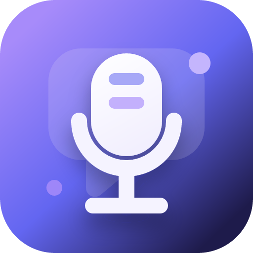
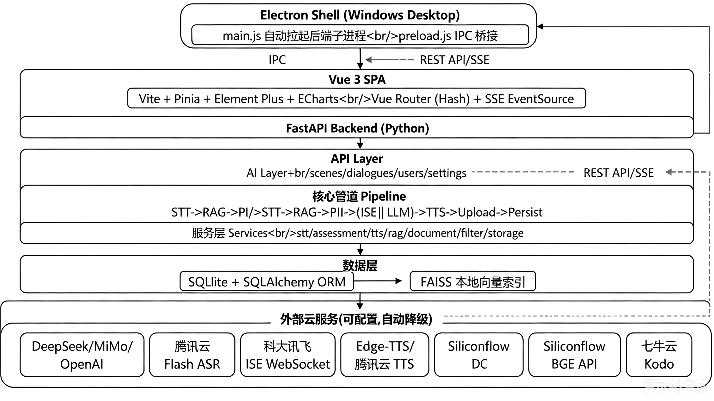

<p align="center">
  
</p>

<h1 align="center">EchoTalk · 云音口语</h1>
<p align="center"><strong>AI 驱动的英语口语陪练桌面应用</strong></p>

<p align="center">
  
  
  
  
  
  
</p>

---

## 🎬 演示视频

<p align="center">
  <a href="https://www.bilibili.com/video/BV1KYEs6YE2D" target="_blank">
    
  </a>
</p>

> 📌 视频将完整展示：场景选择 → 实时语音对话 → 发音评测 → 语法纠错 → 课后总结的全流程体验。

---

## 🌐产品官网

<p align="center">
	<a href="https://echotalk.ackow.cn" target="_blank"><strong>官网链接</strong></a>
	<a href="https://echotalk-2pi.pages.dev" target="_blank"><strong>备用链接</strong></a>
</p>

---

## 📖 项目简介

EchoTalk（云音口语）是一款 **AI 驱动的英语口语陪练桌面应用**，旨在帮助用户在沉浸式场景中进行真实的英语对话训练。应用深度融合 **ASR 语音识别**、**大语言模型角色扮演**、**语音评测引擎** 与 **TTS 语音合成** 等技术，构建了从"听"到"说"再到"评"的完整口语学习闭环。

### 解决的核心问题

| 问题 | EchoTalk 的解决方式 |
|------|---------------------|
| 缺乏语言环境，没有真人陪练 | AI 角色扮演，多场景沉浸式对话 |
| 发音不准，无人纠正 | 科大讯飞 ISE 引擎六维发音评测 + 单词/音素级反馈 |
| 表达不地道，语法错误频出 | LLM 实时语法纠错 + 地道表达升级建议 |
| 练习效果无法量化 | 课后总结 + 历史数据可视化（雷达图、成长曲线） |
| 学习内容单一，缺乏针对性 | RAG 知识库增强，上传资料精准练习特定领域 |

---

## ✨ 功能特性

### 🎭 场景化角色扮演

支持三大内置场景，每个场景有独立的 AI 人格、System Prompt、RAG 知识库和评估规则：

| 场景 | AI 角色 | 核心考察点 |
|------|---------|------------|
| 💼 软件工程师面试 | Sarah（资深面试官） | 专业术语、技术表达、逻辑组织 |
| 🏢 产品发布会会议 | David（产品经理） | 职场沟通、进度汇报、团队协作 |
| 🍽️ 繁忙咖啡厅点餐 | Leo（咖啡师） | 日常口语、礼貌表达、定制化需求 |

支持 **自定义场景导入/导出**（`.zip` 包格式），可无限扩展。

### 🗣️ 实时语音对话

- **ASR 语音识别**：腾讯云 Flash ASR（16k_en 英文模型），精准转录用户语音
- **TTS 语音合成**：腾讯云 TTS / 微软 Edge-TTS 神经网络语音（美音 Emma / 英音 Sonia），自然人声回复
- **流式管道**：SSE 协议分步推送进度（ASR → 评测 → LLM → TTS），消除等待焦虑
- **对话闭环**：AI 自动判结束（is_finished），识别告别/结账/结束语

### 📊 多维度发音评测

集成 **科大讯飞 ISE 流式发音评测引擎**，返回六维评分：

- `total_score` — 综合总分
- `accuracy_score` — 发音准确度
- `fluency_score` — 流利度
- `integrity_score` — 完整度
- `intonation_score` — 语调/重音
- `liaison_score` — 连读/爆破

支持 **单词级 + 音素级** 评分，精准定位发音薄弱点。

### 📝 智能语法与表达纠错

- LLM 对每轮用户输入进行 **语法修正**（原文 → 优化版 → 解释）
- 提供 **地道词汇升级** 建议（附带例句）
- 针对该句的 **语音发音指导**（连读、失去爆破、重音易错点）
- 支持 **口语化 / 书面化** 双风格切换

### 📚 RAG 知识库增强

- 上传 PDF / TXT / Markdown 文档构建场景专属知识库
- **FAISS 向量索引** + BAAI/bge-large-en-v1.5 嵌入模型
- 递归文本分块（RecursiveTextSplitter），保证语义连贯
- 知识分节 **可见性控制**：user 可见 vs ai_only 内部参考
- 未配置 API Key 时自动降级为 **本地 MD5 哈希向量生成器**

### 📈 量化反馈与成长分析

- 每次练习结束自动生成 **课后总结**
- 历史记录完整保存（文本 + 音频回放）
- **ECharts 雷达图** 可视化各维度发音得分
- 多维度分析：流利度、词汇丰富度、语法准确率

### 🛡️ 全链路优雅降级

所有外部云服务在未配置 API Key 或调用失败时，**自动无缝降级为本地 Mock 引擎**，应用始终可用：

| 服务 | 生产引擎 | 降级方案 |
|------|----------|----------|
| LLM 对话 | DeepSeek / Xiaomi MiMo / OpenAI | 本地 Mock 角色对话生成器 |
| ASR 语音识别 | 腾讯云 Flash ASR | 本地 Mock 转录 |
| ISE 发音评测 | 科大讯飞 WebSocket | 本地 Hash 评分模拟器 |
| TTS 语音合成 | Edge-TTS / 腾讯云 TTS | 本地静音 MP3 |
| Embedding 向量化 | Siliconflow BGE API | 本地 MD5 特征哈希 |

---

### 🗣️ 场景对话范围控制——如何防止AI跑题

**问题：** ASR 识别错误或用户无意跑题时，AI 可能偏离场景。

**解决方案：三层一致性验证过滤器**

```
用户输入
    │
    ▼
① 词项域硬过滤（本地执行，不需API）
    │  用户输入与场景关键词集对比
    │  完全无交集 → 直接拦截
    │  命中部分词 → 放行
    ▼
② Embedding 语义相似度
    │  ≥ 0.30 → 放行
    │  0.20~0.30 → 走③ LLM确认
    │  < 0.20 → 明确跑题拦截
    ▼
③ LLM 二次确认（轻量Y/N判断）
    │  "是" → 放行
    │  "否" → 拦截并引导回场景
```

关键词从 System Prompt 和 RAG 知识库自动提取并存入数据库，无需手动维护。所有环节在服务不可用时自动跳过（优雅降级）。

### 🎯 发音评测与语法纠错精准度

**发音评测：** 科大讯飞 ISE 引擎，基于深度学习声学模型，对 16kHz 16bit 单声道 PCM 音频进行音素级分析，返回六维 0-100 评分：

- 准确度 — 音素级别对比标准发音
- 流利度 — 语速、停顿、连读检测
- 完整度 — 音素/单词读出比例
- 语调重音 — 句调升降、单词重音位置
- 连读爆破 — 连读、失去爆破等技巧
- 综合总分 — 加权计算（准确+流利各40%+完整20%）

支持单词级评分（含 dp_message 标记：0=正确/16=漏读/64=替换错误）和音素级评分。Mock 降级时基于文本 Hash 生成确定性评分，相同文本输出相同分数。

**语法纠错：** LLM 对每轮输入执行实时语法分析，输出 原文→优化版→中文解释→多元化建议（语法剖析+词汇升级+发音指导）。支持口语化/书面化双风格自动切换。未配 LLM Key 时降级为 Rule-based 动态纠错引擎，保留用户核心名词基础上做语法修正。

## 🎯 要求对照

| 题目要求 | EchoTalk 实现 |
|----------|---------------|
| **场景选择** | 三大内置场景 + 自定义场景包导入/导出 + 社区分享 |
| **实时语音对话** | 端到端流式管道：ASR → RAG → PII → ISE∥LLM → TTS，SSE 分步推送 |
| **发音评测** | 科大讯飞 ISE 六维评分 + 单词级 + 音素级详情 |
| **语法/表达纠错** | LLM 逐轮语法修正 + 地道表达升级 + 语音发音指导 |
| **课后总结** | 自动汇总评分，历史回放，雷达图可视化 |
| **对话交互自然度** | AI 角色扮演 + System Prompt 人格化 + RAG 上下文增强 |
| **语音端到端流畅性** | 并发管道（ISE 与 LLM 并行）+ Edge-TTS / 腾讯云 TTS 神经网络语音 + 美音/英音切换 |
| **纠错精准度与时机** | 逐轮实时纠错 + 口语化/书面化双风格 + 保留用户原意的基础上润色 |
| **口语能力量化反馈** | 六维评分雷达图 + 历史趋势 + 单词级定位薄弱点 |

---


## 🏗️ 系统架构



### 对话管道详解


---

## 🛠️ 技术栈


---

## 🚀 快速开始

### 环境要求

- **Windows 10 / 11**
- **Python 3.10+**
- **Node.js 18+**

### 本地开发

```bash
# 1. 克隆仓库
git clone https://github.com/Ackow/EchoTalk.git
cd EchoTalk

# 2. 后端
cd backend
python -m venv ../.venv
source ../.venv/Scripts/activate   # Windows Git Bash
pip install -r requirements.txt

# 3. 配置 API 密钥（可选，未配置自动降级为 Mock）
cp .env.template .env
# 编辑 .env，按需填入各服务的 Key

# 4. 启动后端 (FastAPI on :8000)
python main.py

# 5. 前端 (新终端)
cd frontend
npm install
npm run dev                          # Vite on :5173

# 6. Electron 桌面模式
npm run electron:dev                 # 自动拉起后端 + Vite + Electron 窗口
```

### 打包为 Windows 安装包

```bash
cd frontend
npm run pack
# 输出: frontend/dist_electron/EchoTalk Setup 1.0.0.exe
```

---

## 📁 项目结构

```
EchoTalk/
├── backend/                        # FastAPI 后端
│   ├── app/
│   │   ├── api/endpoints/          # REST API (scenes, dialogues, users, settings)
│   │   ├── core/                   # 配置、数据库、日志
│   │   ├── scenes/plugins/         # 场景插件 (interview, meeting, ordering)
│   │   ├── services/               # 核心服务
│   │   │   ├── pipeline.py         # ★ 对话管道编排器
│   │   │   ├── stt.py              # 语音转文字
│   │   │   ├── assessment.py       # 发音评测
│   │   │   ├── tts.py              # 文字转语音
│   │   │   ├── rag.py              # RAG 向量检索
│   │   │   ├── document.py         # 文档解析分块
│   │   │   ├── filter.py           # PII 隐私脱敏
│   │   │   └── storage.py          # 对象存储
│   │   ├── models.py               # SQLAlchemy 数据模型
│   │   └── schemas.py              # Pydantic 请求/响应模型
│   ├── static/                     # 本地音频 + RAG 索引存储
│   ├── tests/                      # 单元测试
│   └── main.py                     # 启动入口
├── frontend/                       # Vue 3 + Electron 前端
│   ├── src/
│   │   ├── views/                  # 页面组件
│   │   │   ├── Home.vue            # 场景选择首页
│   │   │   ├── Practice.vue        # ★ 对话练习核心页
│   │   │   ├── History.vue         # 历史记录回放
│   │   │   ├── Analytics.vue       # 数据成长分析
│   │   │   └── Settings.vue        # 系统设置
│   │   ├── components/             # 通用组件
│   │   ├── store/                  # Pinia 状态管理
│   │   └── router/                 # Vue Router
│   ├── electron/                   # Electron 主进程
│   │   ├── main.js                 # 窗口管理 + 后端子进程
│   │   └── preload.js              # IPC 安全桥接
│   └── package.json
├── docs/                           # 产品官网 (Cloudflare Pages)
│   ├── src/views/                  # 首页 / 文档 / 社区
│   ├── public/scenes/              # 社区场景包自动扫描
│   └── scripts/generate-manifest.cjs  # 场景包清单自动生成
└── tests/                          # 项目级测试
```

---

## 🤝 贡献指南

欢迎贡献！你可以：

- 📦 **分享场景包**：将场景导出为 `.zip` 放入 `docs/public/scenes/`，社区页面自动展示
- 🐛 **报告 Bug**：在 Issues 中提交问题
- 💡 **功能建议**：在 Discussions 中讨论
- 🔧 **提交 PR**：Fork 后提交 Pull Request

---

## 📄 License

MIT © EchoTalk

---

<p align="center">
  <strong>⭐ 如果这个项目对你有帮助，请点亮 Star 支持我！</strong>
</p>

